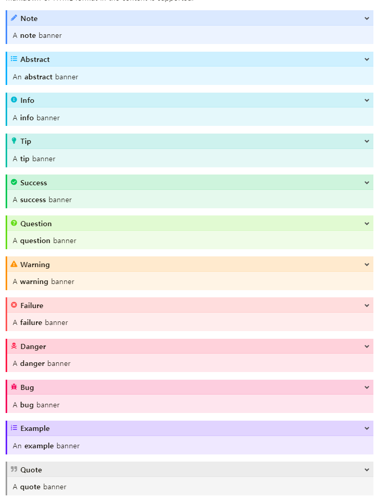

"Callout" refers to the practice of creating blocks of text in a blog post to emphasize specific phrases or statements. In Wowchemy, [the Callout feature](https://wowchemy.com/docs/content/writing-markdown-latex/#callouts) supports only two types: "note" and "warning."

Here are the Callouts supported by Wowchemy

{}
This is an example text.
{}

{}
This is an example text.
{}

It is indeed disappointing that Wowchemy supports only two types of Callouts.

The image you provided shows the "admonition" feature, which is similar to Callouts and is used in the [Doit theme](https://hugodoit.pages.dev). Admonitions support 12 different types and also offer the ability to collapse or expand them.



일단 Wowchemy에서 비슷한 시도가 있는지 검색해보았습니다. 
이 [이슈](https://github.com/wowchemy/wowchemy-hugo-themes/issues/1698#issuecomment-637773325)를 읽어보면 Custom으로 추가가 가능하다고 합니다.
하지만 Custom은 Hugo 테마라면 대부분 되는것이기 때문에 큰 장점은 아닙니다.


I searched for similar attempts in Wowchemy, and found this [issue](https://github.com/wowchemy/wowchemy-hugo-themes/issues/1698#issuecomment-637773325) where it states that custom additions are possible. However, since most Hugo themes support customization, it is not a significant advantage.


I added custom callouts following the Doit theme, with a total of 12 additions. There are three main elements in the callouts: border, background, and icon.

First, I defined a base color and used it to define four additional colors.

1. border-color: The border color is the same as the base color.
2. icon-color: The icon color is the same as the base color.
3. (light) background-color: In the light theme, the background color is 25% brighter than the base color.
4. (dark) background-color: In the dark theme, the background color is 25% darker than the base color.

Additionally, I made sure that each callout can have a different icon applied to it.

Finally, I added the following code to assets/scss/custom.scss.


```css
$callout-icon: (
  'note-admon': '\f304',
  'abstract': '\f1ea',
  'info': '\f129',
  'tip': '\f084',
  'success': '\f164',
  'question': '\f128',
  'warning-admon': '\f071',
  'failure': '\f7a9',
  'danger': '\f12a',
  'bug': '\f188',
  'example': '\f0d0',
  'quote': '\f10e',
);

$callout-color-map: (
  'note-admon': #448aff,
  'abstract': #00b0ff,
  'info': #00b8d4,
  'tip': #00bfa5,
  'success': #00c853,
  'question': #64dd17,
  'warning-admon': #ff9100,
  'failure': #ff5252,
  'danger': #ff1744,
  'bug': #f50057,
  'example': #651fff,
  'quote': #9e9e9e,
);

@each $key, $color in $callout-color-map {
  .alert-#{$key} {
    font-size: 0.9rem;
    border-color: $color;
    background-color: adjust-color($color, $lightness: 25%);
  }

  .dark .alert-#{$key} {
    color: #FFFFFF;
    background-color: adjust-color($color, $lightness: -25%);
  }

  div.alert-#{$key} > div:first-child::before {
    font-size: 0.9rem;
    top: 0.0rem;
    color: $color;
  }
}

@each $key, $icon in $callout-icon {
  div.alert-#{$key} > div:first-child::before {
    content: $icon;
  }
}
``` 

After the additions, the callouts look like the following.

{}
This is note type.
{}
{}
This is abstarct type.
{}
{}
This is info type.
{}
{}
This is tip type.
{}
{}
This is success type.
{}
{}
This is question type.
{}
{}
This is warning type.
{}
{}
This is failure type.
{}
{}
This is danger type.
{}
{}
This is bug type.
{}
{}
This is example type.
{}
{}
This is quote type.
{}


I'm satisfied with the progress so far, but I still feel a bit unsatisfied. However, due to limited knowledge in HTML and CSS, I've reached a limit in creating more. I plan to leave the following tasks as to-dos and summarize:

1. Create a separate shortcode instead of using callouts.
2. Implement an expand/collapse feature.
3. Add a title functionality.
4. Modify the border to only appear on the left side.
5. Distribute the shortcode.

