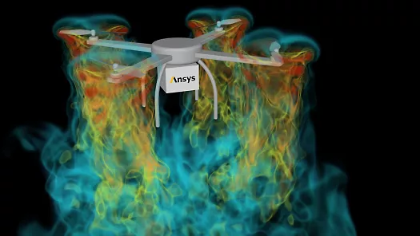
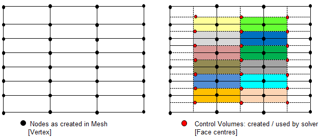
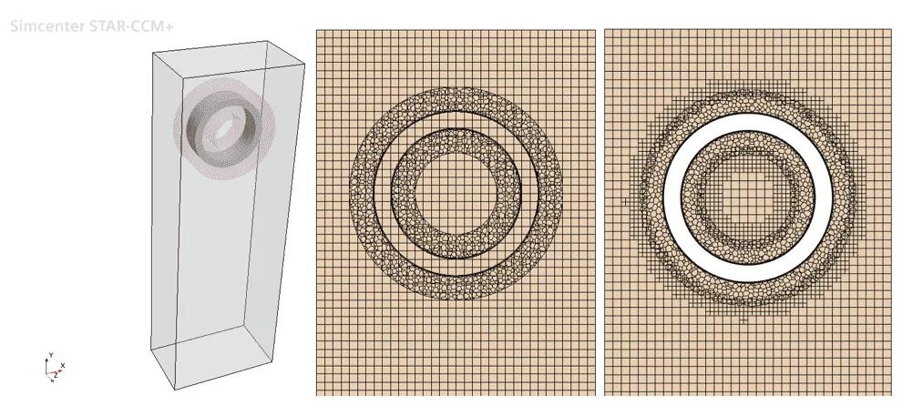

- CFD
- CFX
- EFD-CFD
- Fluent
- RAE-A
- Star-CCM+
- SU2

Paper Link: https://scienceon.kisti.re.kr/commons/util/originalView.do?cn=JAKO201713842134307&oCn=JAKO201713842134307&dbt=JAKO&journal=NJOU00290662

The EFD-CFD workshop was organized under the leadership of professors and researchers from the Korea Aerospace Research Institute. Considering the participants of the workshop, it is expected that institutions such as the Korea Aerospace Research Institute and the Agency for Defense Development will attend. These research institutes have highly skilled research personnel and possess in-house codes. Additionally, graduate students can be expected to participate as well.

In universities, the quality of papers and presentations may vary depending on the research lab. It is also anticipated that they will primarily utilize their in-house codes. The in-house codes of graduate programs have been refined over several years or even decades, so it is likely that their explanations will focus on the advantages of these in-house codes. On the other hand, it is also expected that representatives from commercial CFD software support companies will attend. They will claim that their commercial codes provide accurate interpretations.

With these anticipated participants, what choices did I have to make? Firstly, my company did not possess in-house codes at that time. However, unlike other institutions, we had the advantage of having access to various analysis software. Instead of purchasing only one commercial software for a specific field, our company procured multiple software. Therefore, my goal was to use as many codes as possible for comparison. It was evident that other institutions would interpret their papers using only one code per publication.

In this article, I would like to discuss the stories of the four CFD software packages featured in the papers.

# 1. Ansys Fluent
First and foremost, Ansys [Fluent](https://www.ansys.com/products/fluids/ansys-fluent) was the main software I used, and I was most confident in using it. Ansys acquired Fluent in 2006, and since then, "Ansys Fluent" has been its accurate full name. Fluent has maintained its position as the market leader in the CFD industry for decades. As its reputation suggests, it is capable of analyzing numerous fluid domains and possesses powerful parallel performance. In truth, even in 2017 when I wrote this paper, the solver was powerful, but the user interface (UI) was somewhat inconvenient. However, with yearly updates, the UI improved significantly, and by around 2020, it was not notably inconvenient. Ansys has continued to provide noticeable updates since 2020, and below are some key updates that are relevant and of great interest to me. Although each item could be discussed in detail, my current company does not have a valid license for Fluent, so I cannot perform a proper analysis using it.

## 1-1. Python support

In the field of CFD, where computational speed is crucial, most codes are implemented in core languages such as C++ or Fortran. However, if the code is solely developed in languages like C++, it becomes difficult to utilize the code for external tasks such as creating batch processes or generating tables. Therefore, it is common to combine script-based languages like Python or Perl. Typically, individuals who specialize in CFD are familiar with in-house CFD codes, but if they only use commercial software at work, they may lose touch with coding and their programming skills may deteriorate. However, to achieve an advanced level of proficiency with commercial software, one must learn the scripting language supported by the software to use it effectively. They will have to revisit and work on the code they had previously set aside (which may be an unfamiliar programming language), and some interpretation capabilities may decline.

Fluent had some issues with script support. Fluent's scripting language is [Scheme](https://en.wikipedia.org/wiki/Scheme_(programming_language)), which is a dialect of Lisp and a historically significant programming language. However, its current usage is quite low. Furthermore, CFD practitioners are not typically computer science majors, so the chances of them being proficient in functional programming languages like Scheme are close to zero. There is very little available information on the web as well. This was one of the few weaknesses of Fluent. However, with the recent introduction of Python support, Fluent has overcome this limitation. I have been using Python for quite some time and have a strong affinity for it. If I could continue working with Fluent, Python support would have been a game-changer for me. Detailed information on this topic can be found in the Ansys blog post titled [Providing Open-Source Access to Ansys Fluent with PyFluent](https://www.ansys.com/blog/open-source-access-to-fluent-with-pyfluent)

## 1-2. GPU Support

In the field of AI/ML, the use of GPUs as accelerators has become commonplace. However, GPU acceleration has been challenging in the CFD field. To put it simply, when discussing CPU specifications, we typically mention architecture generation, clock speed, and core count. Servers used for CFD generally have clock speeds of 3.0 MHz or higher and use servers with 30 or more cores. GPUs are often talked about in terms of architecture generation and memory, but they also have their own cores. Nvidia refers to these cores as CUDA cores. For example, an Nvidia V100 has 5210 CUDA cores. Of course, the cores in CPUs and GPUs don't have the same roles or performance. If we were to make an analogy, CPU cores would be like university students, while GPU cores would be like elementary school students. If they were engaged in a tug-of-war, even if a university student had more strength, they wouldn't be able to beat 100 elementary school students. However, what if it was a calculus problem? Even if 100 or 1000 elementary school students were present, they wouldn't be able to solve it. Let's say that traditional CFD problems were like calculus problems. That's why the cores in GPUs, which correspond to elementary school students, couldn't perform well. To solve this, the problem had to be divided into smaller parts so that even elementary school students could handle it. However, until now, there were very few people who succeeded in modifying existing legacy codes in various ways. So the solution was to rewrite the code from scratch. In reality, the analogy I used earlier with elementary school students, university students, and calculus doesn't perfectly align with actual CFD numerical analysis methods. What I wanted to convey is that in order to achieve proper GPU acceleration, it seems that the CFD code had to be rewritten from the beginning. The detailed code for Fluent's GPU solver is not known, but they probably created a new code, which is why it took time to release it. Detailed information on this topic can be found in the Ansys blog post titled [Unleashing the Power of Multiple GPUs for CFD Simulations](https://www.ansys.com/blog/unleashing-the-power-of-multiple-gpus-for-cfd-simulations)

# 2. Ansys CFX
CFX, like Fluent, is a CFD software owned by Ansys. It may raise questions as to why the same company has two CFD software packages. Generally, in most fields, Fluent is used, while CFX is often recommended for turbomachinery applications. However, in reality, CFX was acquired by Ansys before Fluent, with the acquisition taking place in 2003, whereas Fluent was acquired in 2006. Perhaps CFX stepped back as the second option due to the arrival of Fluent.

Currently, CFX receives minimal updates, with the focus primarily on updating Fluent. However, simply stating this does not fully explain the situation. In fact, CFX has a unique and distinctive numerical analysis technique.

## 2-1. Pressure based coupled solver
Fluid dynamics ultimately involves solving equations related to fluid pressure, velocity, density, and other variables. These equations are known as the Navier-Stokes equations, and due to their complexity, there are various solution methods available. They can broadly be categorized into pressure-based or density-based approaches.

In the pressure-based approach, the equations are solved for pressure, velocity, and other variables as separate, independent equations. This approach is known as the Segregated Solver because the equations are segregated or separated. On the other hand, the density-based approach allows simultaneous solution of density and momentum (velocity). This approach is known as the Coupled Solver.

Pressure-based solvers are typically developed for incompressible flows (low Mach number regimes), while density-based solvers are designed for compressible flows (high Mach number regimes). Various numerical analysis techniques have been developed under these solver frameworks, each with their own characteristics.

CFX, on the other hand, is a coupled solver that operates in a pressure-based manner. This means that even though it is pressure-based, it can effectively handle compressible flow regimes. Fluent, in contrast, offers both pressure-based and density-based solvers, allowing users to choose between them based on their specific needs.

## 2-2. Node based(cell-vertex code)

Fluent and other solvers use a cell-centered approach, while CFX is known as a node-based solver. The best way to explain this is through the following diagram.

First, let's consider the grid points, which are referred to as nodes or vertices. Cells are formed by connecting 4 nodes (in the case of hexahedral cells) or 3 nodes (in the case of tetrahedral cells).

In the cell-centered approach, flow data is stored at the center of each cell. This means that the flow variables are defined and calculated at the cell centers.

In contrast, in the node-based approach, flow data is stored at the nodes. However, calculations are performed using separately generated polyhedral volumes based on these nodes.

This approach allows for accurate results even with a relatively coarse grid. By using polyhedral volumes based on the nodes, the solver can capture flow details effectively.

In summary, while Fluent and other solvers use a cell-centered approach where flow data is stored at the cell centers, CFX uses a node-based approach where flow data is stored at the nodes, and calculations are performed using polyhedral volumes.

CFX's unique features are explained in more detail in the following link

[CFX vs. FLUENT(cfd-online)](https://www.cfd-online.com/Forums/cfx/166388-cfx-vs-fluent.html)

[SOLVER SETTING FOR CFD SIMULATIONS](http://www.cfdyna.com/CFDHT/SolverSetting.html)

[Ansys CFX 수치해석 기법 및 특징(태성에스엔이)](https://m.blog.naver.com/PostView.naver?isHttpsRedirect=true&blogId=tsne1234&logNo=221193360368)

---
Despite its unique features, CFX is currently not widely used software, which is unfortunate. It doesn't always perform as well as density-based solvers in compressible flow regimes (high Mach number regimes), as one might expect. By "performing well," I mean whether it offers fast analysis speeds or good convergence even with complex grids.

Of course, these characteristics may be attributed to specific numerical techniques. However, in my personal opinion, one significant reason for the limited development of CFX could be the dominance of Fluent, the leading software within the same company. Having the same license, both software options are available, but Ansys has primarily focused on developing Fluent, which might have limited the resources allocated to CFX.

In my experience, CFX has been rarely used within the company, as Fluent was the preferred choice. I encountered CFX during my graduate studies, and I decided to revisit it now to revive my old memories.

# 3. Star-CCM+
Siemens' Star-CCM+, developed by Siemens, is one of the most widely used software in the field of Computational Fluid Dynamics (CFD), just like Fluent. Originally, Star-CCM+ was developed by a company called CD-Adapco, solely dedicated to developing Star-CCM+. However, Siemens acquired CD-Adapco in 2016. Star-CCM+ had distinctive advantages over Fluent, and I also liked those advantages, so I used Star-CCM+ extensively for simulations.

However, now both Star-CCM+ and Fluent have absorbed each other's strengths, and it seems that either choice is acceptable. Nevertheless, I have identified two distinguishing features.

## 3-1. Overset Mesh
Overset Mesh is a grid that allows overlapping of grids. Typically, grids do not need to overlap each other, but when dealing with moving objects or highly complex geometries, grid generation becomes extremely challenging for both unsteady and steady-state simulations. In such cases, Overset Mesh makes grid generation easier. However, it is essential to choose the appropriate interpolation method for the overlapping regions; otherwise, it may increase computational time and provide inaccurate results. Star-CCM+ has been employing Overset Mesh since the early 2010s. In fact, Fluent also introduced Overset Mesh in the mid-2010s, so Overset Mesh is no longer a unique feature of Star-CCM+. However, even though the functionality may seem the same, a closer examination reveals that Star-CCM+ incorporates more advanced features and considers numerical stability and speed, making a meaningful comparison possible. One of the detailed advanced features is introduced in this blog post: [Overset mesh with AMR, some interesting notes](https://volupe.se/overset-mesh-with-amr-some-interesting-notes) 

## 3-2. Structure Solver
Similar to the Overset feature discussed in 3-1, now Fluent and Star-CCM+ are nearly equal in terms of basic functionality, making it difficult to determine which one is superior. However, Star-CCM+ does have a distinctive advantage over Ansys' Fluent. Ansys, as it grew by acquiring numerous companies, has separate specialized software for pre-processing and post-processing, in addition to Fluent. Ansys Mechanical is the software for structural analysis and where the company started. Consequently, users sometimes need to employ three separate software, each for pre-processing, analysis, and post-processing, even when performing CFD simulations. In contrast, Star-CCM+, originally developed by CD-Adapco, a company specializing solely in CFD, includes pre-processing and post-processing capabilities within a single interface. This integrated approach allows users to perform all CFD tasks in one window, which is a significant advantage. In cases where structural analysis is required in addition to CFD, it is preferable to use Ansys Mechanical alongside Fluent. However, Star-CCM+ incorporates a structural analysis solver within the same software, eliminating the need for separate software. Furthermore, Star-CCM+ aims to support advanced features such as contact in the structural analysis solver, as mentioned in this [blog post](https://blogs.sw.siemens.com/simcenter/fluid-structure-interaction-fsi-with-mechanical-contact-in-one-simulation-yes-in-one/). Although Fluent also has built-in post-processing capabilities and a separate structural analysis solver, until 2020, its functionality was significantly limited compared to other dedicated software offered by Ansys.

# 4. SU2

After selecting three commercial CFD codes, I felt it was necessary to include at least one open-source option. The most famous open-source CFD software is OpenFoam, but for this paper, [SU2](https://su2code.github.io) was chosen. As of around 2017, OpenFoam had issues with convergence in compressible flow simulations at high Mach numbers. Convergence was often not achieved, and simulations frequently diverged. While it is possible to improve OpenFoam by making modifications since it is an open-source software, such modifications could lead to an unfair comparison. Therefore, simulations had to be conducted in their native states. Unlike OpenFoam, SU2 was already designed as a compressible flow solver, making it suitable for analysis. However, it struggled with low Mach number problems. In such cases, the solutions did not diverge but exhibited significant oscillations, making it difficult to achieve convergence. SU2 was originally an in-house code developed by Stanford University's Aerospace Design Lab and was open-sourced in 2012. As it originated in the field of aerospace engineering, it is well-suited for aerodynamic analysis. However, it seems that SU2's application is still relatively limited compared to the more versatile OpenFoam. To be honest, my interest in SU2 stemmed from a desire to develop my own specialized skills by choosing a less commonly used code. However, being less popular in Korea made it challenging to grow in that direction.

---

This has already become quite a long text just up to this point.
I have more to say, so I would like to write a separate post.
