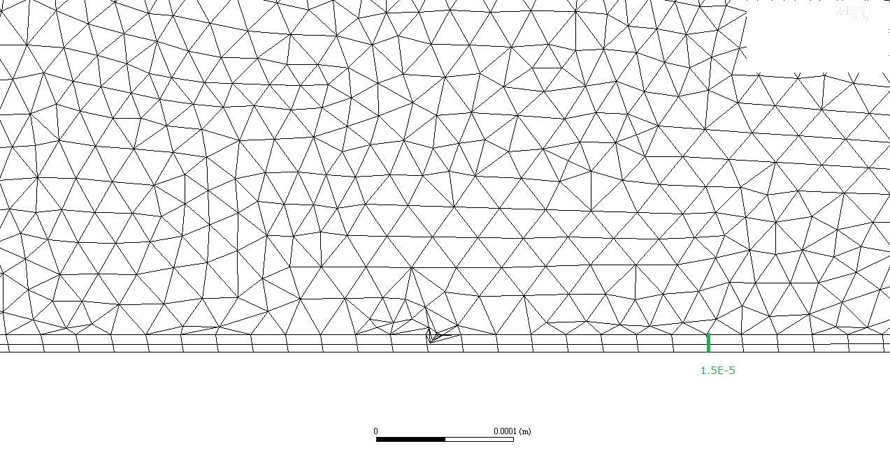

In academic papers, it is common to only highlight successful cases and omit mentioning failures or difficulties encountered. When I was writing this paper, I faced a challenging obstacle that I couldn't include in the paper, and I had to write it as if I had smoothly resolved and interpreted it. Therefore, I would like to share the untold story from this paper.

One of the differences between a missile and an aircraft is that missiles lack space for wings. Consequently, wing size needs to be minimized, and they often need to be stowed somewhere. If they are stowed, the wings must unfold or deploy. The deployment mechanism often involves the use of elastic forces, such as springs, or the utilization of centrifugal forces. In this paper, the wings utilize the concept of elasticity, where they are folded like a spring during storage and then unfold due to the stored elastic energy. To achieve such wings, they need to be thin yet robust, possessing high strength. Additionally, they undergo rotation, subjecting them to centrifugal forces. Aerodynamics play a role in dampening these forces. The diagram below is an excerpt from a referenced paper in this study. The following figure is an excerpt from reference[^1] cited in this paper.

To summarize, for simulating the wing deployment, it is necessary to perform structural analysis to mimic elastic forces, dynamics analysis to mimic centrifugal forces, and computational fluid dynamics analysis to mimic aerodynamic forces. Typically, these analyses are highly challenging because each discipline requires specialized software and integrating them is not straightforward. Consequently, it is common to choose one analysis software for a specific discipline and simplify the others by making certain assumptions. However, I ambitiously decided to simultaneously perform all three analyses. In particular, when performing fluid and structural analysis together, it is known as Fluid-Structure Interaction (FSI), which is considered one of the most challenging analyses in the field of computational fluid dynamics. I have always had a strong interest in FSI analysis since my student days and dedicated myself to this field. The following figure is the famous Turek-Hron Case[^2], which is one of the FSI cases.

")

To proceed with the paper, the selection of analysis software was crucial. For fluid analysis, I chose [Ansys Fluent](https://www.ansys.com/products/fluids/ansys-fluent), which I was most confident with. Opting for Fluent made it advantageous for my mental well-being to choose [Ansys Mechanical](https://www.ansys.com/products/structures/ansys-mechanical), the structural analysis software from the same company. As for dynamics analysis, I didn't use a separate software. This was because simple dynamics analyses can be performed within Fluent or Ansys Mechanical. I implemented the application of centrifugal forces and hinge modeling using Ansys Mechanical.

The most challenging aspects of this paper originated from two phenomena: large deformations and contact. Firstly, the wing deformations in this paper were significant. Structural analyses are categorized into linear and nonlinear analyses, and large deformations require nonlinear analysis. However, many structural analysis software options do not adequately support nonlinear analysis. In fluid analysis, large deformations imply significant grid movements. When using Fluent, I encountered difficulties achieving the desired level of grid motion simulation during deformation with smoothing and remeshing, even at the time of writing the paper.

Contact also posed significant challenges for both fluid and structural analyses. As mentioned earlier, the wings start in a completely stowed position, meaning they are fully in contact with the fuselage. In structural analysis, contact can give rise to reaction forces and requires nonlinear analysis. In fluid analysis, contact is a highly intricate problem, primarily due to grid handling. From a fluid perspective, when contact occurs, the grid in that region should disappear, and when contact is absent, the grid needs to be regenerated. Implementing such processes becomes difficult, and typically complex treatments such as placing dummy grids and preventing flow within those grids based on contact conditions are necessary.

Fortunately, in structural analysis, I was able to overcome these two challenges successfully. However, in fluid analysis, grid handling proved to be extremely challenging. Despite performing remeshing, the grids frequently became tangled and caused computation failures. Remeshing and grid tangling even resulted in reduced reproducibility. What this means is that when remeshing under the same conditions, the grids were not consistently regenerated. Generally, slight differences in grid generation do not significantly affect the calculation results. However, due to the constrained nature of the shape in this paper's analysis, such discrepancies in grid tangling could occur. When grid tangling occurs, computations "fail," rendering it impossible to proceed further. The figure below is taken from Ansys Forum[^3], demonstrating the occurrence of grid distortion in the central region.

Furthermore, this analysis is transient and coupled fluid-structure interaction analysis, which takes more than five times longer than conventional fluid analysis. If a computation fails during the process, it requires starting over from intermediate steps, and repeated failures can occur, leading to the need for multiple attempts to achieve a single successful case. Therefore, to complete this paper, I had to make numerous computational attempts, selecting only the successful cases. In other fields, failed cases and success probabilities may hold valuable data, but in this paper's computational simulation, it should demonstrate consistent results under the same conditions and with the same software for anyone attempting it. However, it fell short of achieving that consistency. This is a story I failed to include in the paper.

If I were to go back and redo the research, I would consider changing the solver for the analysis. One option that comes to mind is using a meshless CFD software such as Meshless CFD to alleviate the challenge of grid tangling. However, Meshless CFD is still relatively uncommon in computational fluid dynamics and not easily integrated with structural analysis. It would require finding an analysis software that supports difficult analysis conditions (contact, large deformations) in both fluid and structural domains and ensures seamless coupling between them. Though it is now difficult to go back to those times, fluid-structure interaction analysis remains a field I have a strong affinity for.

[^1]: 2013, Forsblom, M., "Supersonic Artillery Projectile Fin Deployment Simulation Methodology," Master Thesis of Luleå University of Technology

[^2]: precise Tutorials, "Turek Hron FSI3", https://precice.org/tutorials-turek-hron-fsi3.html

[^3]: Ansys Learning Forum, "Negative Cell Volume", https://forum.ansys.com/forums/topic/negative-cell-volume
