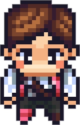

## ChatDev 소개
ChatGPT의 출시 이후 코딩을 할 때도 여러모로 도움을 많이 받고 있습니다. 
처음에는 간단한 기능에 대해 코드를 만들어 달라고 하거나 이미 만든 코드를 깔끔하게 바꿔달라는 식으로 활용했습니다.
그러다 [github copilot](https://github.com/features/copilot)라고 하여 IDE에 플러그인으로 사용 가능한 도구도 사용해보았습니다. 
저에게는 너무 좋은 도구였는데 유료이다 보니 마지막에 스퍼트를 내야할 때만 사용하고 있습니다.

여기서 AI를 활용한 또 다른 SW 개발도구인 [ChatDev](https://github.com/OpenBMB/ChatDev)를 소개합니다.
ChatDev는 한마디로 정의하면 **멀티 에이전트 SW 개발 도구**라고 할 수 있습니다. 
이 정의를 이해하려면 생성 AI에서 **에이전트**가 무엇인지를 알아야 합니다.
다만 이 글에서는 에이전트에 대한 학문적인 설명은 하지 않으려고 합니다.

아래 논문과 리뷰들을 통해 정보를 얻기 바랍니다.

[논문](https://arxiv.org/abs/2307.07924)

[ChatDev 리뷰](https://blog.firstpenguine.school/108)


## ChatDev 사용법 및 세부 설정
ChatDev에서는 한줄로 실행 가능한 코드 전체를 제공하는 것을 목표로 합니다.
예를 들어

```bash
python3 run.py --task "Develop a basic Gomoku game." 
```

라는 명령을 주면 정말로 오목(Gomoku)게임을 할 수 있는 코드가 만들어지는 겁니다.

세부적인 단계를 살펴보면 각각 여러명의 가상인물에게 역할을 부여하고 단계를 정의하여 마치 가상의 회사에서 SW개발을 하는 것처럼 진행이 됩니다.
이런 설정들은 모두 ChatGPT와의 대화인 것이고 기본으로 주어지는 설정(대화)들은 영어로 되어있습니다.
예를 들어 프로그래머에게는 아래와 같은 역할을 대화로 부여하는 것입니다.

{}
"You are Programmer. we are both working at ChatDev. We share a common interest in collaborating to successfully complete a task assigned by a new customer.",

"You can write/create computer software or applications by providing a specific programming language to the computer. You have extensive computing and coding experience in many varieties of programming languages and platforms, such as Python, Java, C, C++, HTML, CSS, JavaScript, XML, SQL, PHP, etc,.",

"Here is a new customer's task: {task}.",

"To complete the task, you must write a response that appropriately solves the requested instruction based on your expertise and customer's needs."
{}

코드 생성 단계에서는 다음과 같이 단계를 정의합니다. 역시 ChatGPT와 대화하는 것이며 기본으로 주어지는 설정은 영어로 되어있습니다.

{}
"We have decided to complete the task through a executable software with multiple files implemented via {language}. As the {assistant_role}, to satisfy the new user's demands, you should write one or multiple files and make sure that every detail of the architecture is, in the end, implemented as code. {gui}",

"Think step by step and reason yourself to the right decisions to make sure we get it right.",

"You will first lay out the names of the core classes, functions, methods that will be necessary, as well as a quick comment on their purpose.",

"Then you will output the content of each file including complete code. Each file must strictly follow a markdown code block format, where the following tokens must be replaced such that \"FILENAME\" is the lowercase file name including the file extension, \"LANGUAGE\" in the programming language, \"DOCSTRING\" is a string literal specified in source code that is used to document a specific segment of code, and \"CODE\" is the original code:",
{}

## ChatDev 한국어 커스텀

저는 ChatDev의 사용자로서 사용해본 사례를 소개함과 동시에 한국어로도 사용가능한가에 대해 관심을 가지게 되었습니다.
위의 역할과 단계들은 사용자가 커스텀할 수도 있습니다.
그래서 저도 커스텀을 시도하면서 영어가 아닌 한국어로 해보려고 합니다. 
예를 들어 이런 식입니다. 


{}
"당신은 프로그래머입니다. 현재 우리는 ChatDev에서 함께 일하고 있습니다. 새로운 고객이 할당한 작업을 성공적으로 완료하기 위해 협력에 공통적인 관심을 가지고 있습니다.",

"여러분은 컴퓨터에 특정 프로그래밍 언어를 제공하여 컴퓨터 소프트웨어나 애플리케이션을 작성/생성할 수 있습니다. 여러분은 Python, Java, C, C++, HTML, CSS, JavaScript, XML, SQL, PHP 등 여러 가지 프로그
래밍 언어와 플랫폼에서 광범위한 컴퓨팅 및 코딩 경험을 가지고 있습니다.",

"여기에 새로운 고객의 작업이 있습니다: {task}.",

"작업을 완료하기 위해 여러분은 여러분의 전문 지식과 고객의 요구에 기반하여 요청된 지침을 적절히 해결하는 응답을 작성해야 합니다."
{}

사실 이전 장의 영어 문장들을 거의 그대로 번역한 것입니다.
다만 코드에 사용되어 번역하면 안되는 단어들도 있습니다. 
이런 단어들은 수동으로 걸러내는 등의 약간의 수정을 가했습니다.
이런 설정 파일은 3개가 있고 두개의 파일을 번역했습니다. 
이 파일들은 별도로 공유하려고 합니다.


## ChatDev 한국어 커스텀 결과

이제 한국어로 명령을 주겠습니다.

```bash
python3 run.py --task "오목 게임을 만들어줘" --config "Story"
```

여기서 --config에 새로 만든 설정 파일들의 폴더를 작성합니다.
이전 단계에서 설명을 빠트렸는데 Story란 이름으로 설정 파일들의 폴더를 작성하였습니다.
이건 ChatDev에서 가상의 회사를 의미합니다.
즉 Story란 가상의 회사를 세웠다고 받아들여도 됩니다.

ChatDev에서는 진행 과정을 대화 형식으로 볼 수 있습니다. 

### 단계 1 요구분석(Demand Analysis)

첫번째 단계는 CEO(Chief Executive Officer, 최고경영자)와 CPO(Chief Product Officer, 최고상품책임자)가 수행합니다. 대화를 들어봅시다.


<iframe src="./log.html" width="640" height="500"></iframe>

<iframe src="./step1.html" width="640" height="500"></iframe>


여기서 모달리티(modality)란 단어가 나옵니다. SW의 형태,양식을 정하는 것으로 Excel, Application, Mind Map 같은 예시를 들어주고 있습니다. 한국어로 번역하기가 애매하여 모달리티라고 표현했는데 적절한 단어가 있다면 바꾸는게 좋을 것 같습니다.

대체로 Application 모달리티가 좋다고 하며 이런저런 기능들을 추천합니다. CEO가 질문 한 상태에서 마무리가 되는데 대화 턴을 2번으로 제한하였기 때문입니다.


### 단계2 언어 선정(Language Choose)

프로그래밍 언어를 선정하는 단계입니다.


여기서 예시를 드는 분이 잘못들가는 것 같습니다.
별다른 토론을 하지 않고 Python을 선정합니다.
이 부분이 잘 못되어 그런것 같은데 나중에 보완하도록 합시다.


### 단계3 코딩(Coding)

3번째 단계는 코딩 단계입니다.
CTO(Chief Technology Officer)와 프로그래머(Programmer)가 수행합니다.

<div style="position: relative; display: flex; flex-direction: column; width: 773px;">
<div style="display: flex; background-color: lightblue; width: fit-content; padding: 5px 20px; margin-bottom: 5px; font-size: 13px; border: 1px solid rgba(11, 20, 150, 0.3); border-radius: 10px; box-shadow: black 2px 2px 2px;">
<p>Programmer</p>

</div>
<div class="markdown-body" style="padding: 10px; border: 1px solid rgba(11, 20, 150, 0.3); width: 750px; border-radius: 10px; box-shadow: black 2px 2px 2px; background-color: rgb(19, 49, 83);">
<p>main.py</p>
<pre><code class="language-python">'''
This is the main file of the Gomoku game.
'''

import tkinter as tk
from game import Game

def main():
    root = tk.Tk()
    game = Game(root)
    game.start()
    root.mainloop()

if __name__ == "__main__":
    main()
</code></pre>
<p>game.py</p>
<pre><code class="language-python">'''
This file contains the Game class which represents the Gomoku game.
'''

import tkinter as tk

class Game:
    def __init__(self, root):
        self.root = root
        self.root.title("Gomoku")
        self.canvas = tk.Canvas(self.root, width=600, height=600)
        self.canvas.pack()
        self.canvas.bind("&lt;Button-1&gt;", self.on_click)
        self.board = [[0] * 15 for _ in range(15)]
        self.current_player = 1

    def start(self):
        self.draw_board()

    def draw_board(self):
        self.canvas.delete("all")
        for i in range(15):
            self.canvas.create_line(0, i * 40, 600, i * 40)
            self.canvas.create_line(i * 40, 0, i * 40, 600)

    def on_click(self, event):
        x = event.x // 40
        y = event.y // 40
        if self.board[y][x] == 0:
            self.board[y][x] = self.current_player
            self.draw_piece(x, y)
            if self.check_win(x, y):
                self.show_winner()
            else:
                self.current_player = 3 - self.current_player

    def draw_piece(self, x, y):
        if self.current_player == 1:
            color = "black"
        else:
            color = "white"
        self.canvas.create_oval(x * 40 + 5, y * 40 + 5, x * 40 + 35, y * 40 + 35, fill=color)

    def check_win(self, x, y):
        directions = [(1, 0), (0, 1), (1, 1), (1, -1)]
        for dx, dy in directions:
            count = 1
            for i in range(1, 5):
                nx = x + dx * i
                ny = y + dy * i
                if nx &lt; 0 or nx &gt;= 15 or ny &lt; 0 or ny &gt;= 15 or self.board[ny][nx] != self.current_player:
                    break
                count += 1
            for i in range(1, 5):
                nx = x - dx * i
                ny = y - dy * i
                if nx &lt; 0 or nx &gt;= 15 or ny &lt; 0 or ny &gt;= 15 or self.board[ny][nx] != self.current_player:
                    break
                count += 1
            if count &gt;= 5:
                return True
        return False

    def show_winner(self):
        if self.current_player == 1:
            winner = "Black"
        else:
            winner = "White"
        self.canvas.create_text(300, 300, text=f"{winner} wins!", font=("Arial", 30), fill="red")
</code></pre>
<p>이제 코드를 실행하면 Python으로 구현된 오목 게임이 실행됩니다. GUI를 통해 게임을 플레이할 수 있으며, 검은색과
흰색 돌을 번갈아가며 놓을 수 있습니다. 승리 조건은 5개의 돌을 연속으로 놓는 것입니다. 승리한 플레이어는 화면에 표시됩니다.</p>
</div>
</div>


### 단계4

### 단계5

### 단계6

### 단계7


모든 단계가 끝났고 파일이 다 만들어졌습니다.

다음과 같이 실행해보겠습니다.
정말 놀랍게도 잘 실행이 됩니다.


다만 매뉴얼을 영어로 작성했습니다. 물론 어떻게 작성하라고 정확히 지시하지 못한 저의 잘못일수도 있고요.


## 결론
ChatDev를 사용하면서 여러 비판이 있을 수 있습니다. 
하지만 ChatDev에서 현재까지의 예제는 간단한 SW밖에 없고 이런 간단한 SW가 실제 사용되는 일은 없을겁니다.
다만 ChatDev는 출시된지 2개월밖에 안되는 오픈소스이기 때문에 충분히 발전 가능한 도구라고 기대할 수 있습니다.

그리고 ChatDev는 처음부터 개발하는 기능 외에 이미 있는 코드에 추가 기능을 넣는 기능도 있습니다.
사실 이 기능을 더 테스트 해보고 싶었습니다.
깃헙의 오픈소스들을 보면 잘 되는 것도 있지만 버려진 오픈소스들도 많습니다.
이런 오픈소스중에 쓸만한 것도 있는데 계속 유지보수가 안되는 상황이라면 미래에 문제가 생길 수 있기 때문에 사용하기가 꺼려집니다.
ChatDev를 이용해서 그런 버려진 오픈소스에 생명을 불어넣는게 가능하지 않을까 기대를 해봅니다.

다만 ChatDev는 무료로 사용할 수는 없고 ChatGPT의 API가 필요합니다. 
이 API를 호출하는데 약간의 돈이 들어가게 됩니다. 
위의 결과를 테스트하는데 실제로는 한번의 테스트로 되진 않았고 여러번 실행을 했었습니다.
이런 저런 설정 테스트를 하려면 비용이 더 발생할 것이므로 신중하게 하려고 합니다.
참고로 Local LLM이나 ChatGPT가 아닌 생성형 AI도 곧 ChatDev에 지원이 가능할 수도 있습니다.
궁극적으로 여러 LLM을 활용하여 에이전트(ChatDev에서는 가상의 회사직원이라고 생각하면 됩니다)를 활용하려고 하는것입니다.


이 글을 요약하겠습니다.

1. ChatDev 프레임워크는 여러 LLM 에이전트를 활용하여 SW개발을 하는 도구입니다.
2. ChatDev에서는 가상의 SW 개발 회사를 만드는 것처럼 직원과 개발 단계를 정의할 수 있습니다.
3. ChatDev에서 한국어로 소통하는 한국 회사를 커스텀하였고 간단한 오목 게임을 만드는 것을 성공하였습니다. 
