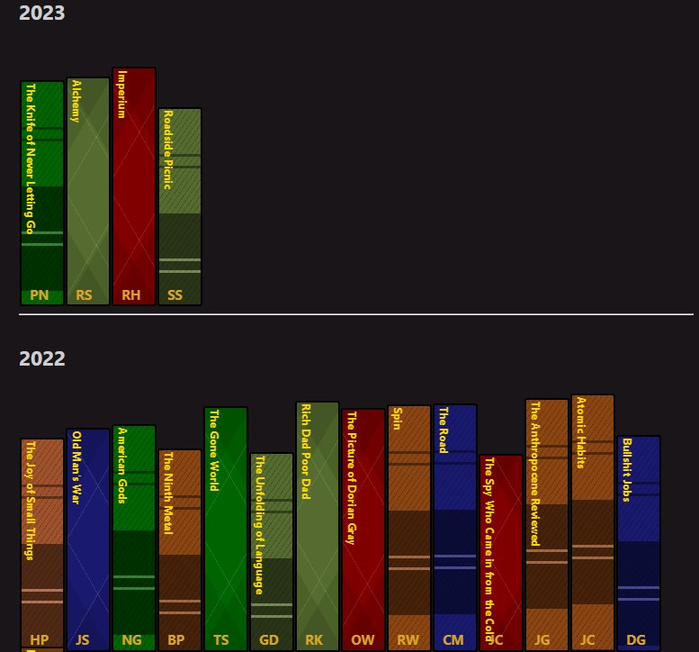

[Hugo](https://gohugo.io)는 마크다운으로 정적 사이트를 만드는 효율적이고 빠른 프레임워크입니다. 
마크다운을 사용하여 블로그 글을 작성하는 것은 간단하고 직관적이며, 마크다운의 간결함 덕분에 콘텐츠에 집중할 수 있습니다.
하지만 때로는 마크다운만으로는 웹사이트를 원하는 대로 멋지게 꾸밀 수 없는 경우가 있습니다.
이러한 한계를 극복하기 위해 Hugo는 HTML 문법을 지원하며, 더욱 풍부한 사용자 경험을 제공하기 위한 [Shortcodes](https://gohugo.io/content-management/shortcodes/) 기능을 제공합니다.

Shortcodes는 Hugo에서 제공하는 강력한 기능으로, 사용자가 웹사이트에 복잡한 HTML, CSS, 혹은 JavaScript 없이도 다양한 커스텀 요소를 쉽게 삽입할 수 있게 해줍니다. 
이미지 갤러리, 비디오, 탭 등을 마크다운 파일에 직접 삽입하고 싶을 때 Shortcode를 사용하면 매우 편리합니다.
예를 들어 유튜브를 삽입하고 싶으면 마크다운에서 다음과 같이 작성하면 됩니다.

    

저는 이러한 Shortcode의 장점을 활용하여, 책장(Bookshelf)에 관한 새로운 Shortcode를 개발했습니다.
제가 개발한 이 Shortcode는 사용자가 읽은 책이나 앞으로 읽을 책들을 웹사이트에서 보기 좋게 디스플레이 할 수 있도록 도와줍니다.
인터넷에는 다양한 도서 서비스 사이트가 있지만, 개인의 블로그에서 직접 책들을 소개하고 싶은 욕구가 있었습니다.

이러한 동기에서 출발하여, 저는 두 개의 다른 사이트를 참고하였습니다.

이들 사이트는 자신들의 코드를 공유하고 있었으며, HTML을 직접 사용할 수 있는 경우에는 쉽게 따라 할 수 있었습니다.
그러나 Hugo 사용자들이 보다 편리하게 이 기능을 사용할 수 있도록 Shortcode로 구현하는 것을 목표로 했습니다.

Shortcode를 구현하기 위해 필요한 HTML, CSS, JavaScript 파일들을 만들면서, 저는 [코드펜(CodePen)](https://codepen.io/)에 예제를 만들었습니다.
코드펜은 웹사이트를 공부하기 매우 좋은 사이트로 웹사이트안에 에디터가 있어 코드를 변경할 때 마다 실시간으로 렌더링되므로 개발할 때 매우 용이합니다.

<iframe height="400" style="width: 100%;" scrolling="no" title="Virtual-Bookshelf" src="https://codepen.io/Jong-Rok-Kim/embed/NWEWepo?default-tab=html%2Cresult" frameborder="no" loading="lazy" allowtransparency="true" allowfullscreen="true">
  See the Pen <a href="https://codepen.io/Jong-Rok-Kim/pen/NWEWepo">
  Virtual-Bookshelf</a> by Jong Rok Kim (<a href="https://codepen.io/Jong-Rok-Kim">@Jong-Rok-Kim</a>)
  on <a href="https://codepen.io">CodePen</a>.
</iframe>

<iframe height="400" style="width: 100%;" scrolling="no" title="Front-Bookeshelf" src="https://codepen.io/Jong-Rok-Kim/embed/vYMKVMP?default-tab=html%2Cresult" frameborder="no" loading="lazy" allowtransparency="true" allowfullscreen="true">
  See the Pen <a href="https://codepen.io/Jong-Rok-Kim/pen/vYMKVMP">
  Front-Bookeshelf</a> by Jong Rok Kim (<a href="https://codepen.io/Jong-Rok-Kim">@Jong-Rok-Kim</a>)
  on <a href="https://codepen.io">CodePen</a>.
</iframe>

구현한 Shortcode는 Hugo에서 매우 간단하게 사용할 수 있습니다. 마크다운 파일의 Front Matter에 몇 줄의 코드를 추가하고 본문에 원하는 위치에 Shortcode를 다음과 같이 사용하면 책장을 디스플레이 할 수 있게 됩니다.

    

    




두 Shortcodes의 리포지토리는 다음과 같습니다.

🤩 [Hugo Bookshelf Shortcode](https://github.com/kjrstory/hugo-shortcode-bookshelf)

😎 [Hugo Front Bookshelf Shortcode](https://github.com/kjrstory/hugo-shortcode-front-bookshelf)

또한, 이러한 Shortcode들은 MIT 라이선스 하에 배포되어 있으며, 출처를 밝히는 것 외에는 사용에 제한이 없습니다. 

이 프로젝트를 진행하며, [Goodreads](https://www.goodreads.com)와 같은 유명 도서 서비스 사이트의 존재도 알게 되었습니다. 
미래에 위의 두 Shortcodes를 멋있게 꾸미는 일외에도 goodreads의 API를 이용한 연동도 고려하고 있습니다.

