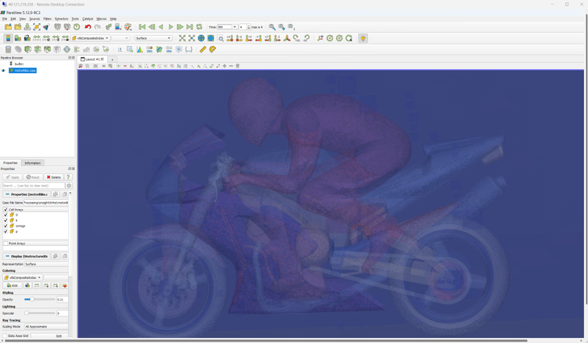

## Azure

### Learn how to power your AI transformation with the Microsoft Cloud at NVIDIA GTC

* [Link](https://techcommunity.microsoft.com/t5/azure-high-performance-computing/learn-how-to-power-your-ai-transformation-with-the-microsoft/ba-p/4043868)
* 일자 : 2/09
* [Nvidia GTC](https://www.nvidia.com/gtc/)(3/18~21)에 Microsoft 세션 소개

### Accelerating OpenFOAM Integration with Azure CycleCloud

* [Link](https://techcommunity.microsoft.com/t5/azure-high-performance-computing/accelerating-openfoam-integration-with-azure-cyclecloud/ba-p/4055616)
* 일자: 2/13
* 오픈소스 CFD 코드인 [OpenFOAM](https://www.openfoam.com)을 Azure에서 설치하고 간단한 예제를 수행하는 스크립트를 제공

### Choosing the Right Azure Spot VM for Rendering Workloads Using MoonRay 

* [Link](https://techcommunity.microsoft.com/t5/azure-high-performance-computing/choosing-the-right-azure-spot-vm-for-rendering-workloads-using/ba-p/4056551)
* 일자: 2/14
* [MoonRay](https://github.com/dreamworksanimation/openmoonray)(드림웍스 애니메이션에서 개발한 몬테카를로 레이 트레이싱 렌더러)를 Azure H-시리즈에서 사용할 때의 성능과 가성비를 평가
* 성능(렌더링 속도)은 가장 최신 세대인 HBv4(AMD EPYC Genoa-X)가 가장 좋음. 이는 CPU의 발전으로 인한 당연한 결과
* 단 가성비는 이전 세대인 HBv3(AMD EPYC Milan-X)가 가장 우수하며 HBv4에 비해 4~6배의 큰 차이가 있음. 이는 Spot 가격으로 인한 것으로 HBv4는 물량에 제한이 있어 Spot 가격이 HBv3보다 상대적으로 비싸기 때문
* Spot 가격은 시기마다 변동이 됨을 인지하고 사용자의 시뮬레이션이 Spot 인스턴스의 정책(시작 시점 불분명하고 갑자기 종료 될 수 있는 특징)에 맞게 변경 가능해야함

### Quick HPC Cluster Creation with Apps using CycleCloud and EESSI: A WRF example

* [Link](https://techcommunity.microsoft.com/t5/azure-high-performance-computing/quick-hpc-cluster-creation-with-apps-using-cyclecloud-and-eessi/ba-p/4062544)
* 일자: 2/22
* EESSI는 유럽을 중심으로 HPC의 소프트웨어를 편리하게 설치하는 프로젝트
* Azure의 CycleCloud에서 Custom Template기능이 있어서 EESSI환경이 설치된 클러스터 템플릿을 만들 수 있음
* EESSI템플릿을 제공하고 기후 시뮬레이션 어플리케이션인 WRF을 실행하는 예제를 보여줌

### Scaling Up in the Cloud: The WEKA Data Platform and Azure HPC Windows Grid Integration

")
* [Link](https://techcommunity.microsoft.com/t5/azure-high-performance-computing/scaling-up-in-the-cloud-the-weka-data-platform-and-azure-hpc/ba-p/3997491)
* 일자: 2/27
* WEKA Data Platform을 Azure에서 6개의 스토리지 노드와 3개의 프로토콜 노드로 21TB의 볼륨을 구축하여 성능 검증
* WEKA는 고성능 스토리지 플랫폼으로 HPC 워크로드를 처리하는데 탁월하며 가장 성능이 좋은 SMB 공유를 처리하는데 가장 적합함

## AWS
### Dynamic HPC budget control using a core-limit approach with AWS ParallelCluster

* [Link](https://aws.amazon.com/ko/blogs/hpc/dynamic-hpc-budget-control-using-a-core-limit-approach-with-aws-parallelcluster/)
* 일자: 2/08
* HPC클러스터에서 매주 동적으로 예산 관리하는 방법 소개
* AWS의 Cost Explorer 기능과 Slurm의 License management method를 이용
* [Dynamic EC2 budget control](https://github.com/aws-samples/dynamic-ec2-budget-control)에 샘플 코드를 공개

### Amazon’s renewable energy forecasting: continuous delivery with Jupyter Notebooks

* [Link](https://aws.amazon.com/ko/blogs/hpc/amazons-renewable-energy-forecasting-continuous-delivery-with-jupyter-notebooks/)
* 일자: 2/13
* 신재생 에너지 예측을 위해 주피터 노트북으로 지속적 배포(continuous delivery)를 구현한 방법을 소개
* 주피터 노트북을 다양하게 활용하기 위한 툴(본 글에서는 [Papermill](https://github.com/nteract/papermill))에 주목할 필요가 있음

### How agent-based models powered by HPC are enabling large scale economic simulations

* [Link](https://aws.amazon.com/blogs/hpc/how-agent-based-models-powered-by-hpc-are-enabling-large-scale-economic-simulations/)
* 일자: 2/20

### Accelerating agent-based simulation for autonomous driving

* [Link](https://aws.amazon.com/blogs/hpc/accelerating-agent-based-simulation-for-autonomous-driving-with-hpc/)
* 일자: 2/26

### Improve the speed and cost of HPC deployment with Mountpoint for Amazon S3

* [Link](https://aws.amazon.com/blogs/hpc/improve-the-speed-and-cost-of-hpc-deployment-with-mountpoint-for-amazon-s3/)
* 일자: 2/27

## GCP

### Salk Institute scientists scale brain research on Google Cloud with SkyPilot

* [Link](https://cloud.google.com/blog/topics/hpc/salk-institute-brain-mapping-on-google-cloud-with-skypilot?hl=en)
* 일자: 2/06
* Salk 연구소는 Google Cloud와의 협력을 통해 컴퓨팅 비용을 20% 절감하고 전체 쥐 뇌를 분자 수준에서 매핑하는 대규모 생물학적 데이터 분석을 수행
* Spot VMs, Cloud Storage, Filestore 등 Google Cloud 서비스와 UC 버클리의 [SkyPilot](https://skypilot.readthedocs.io/en/latest/) 프로젝트를 활용하여 데이터 처리 워크플로우를 간소화하고 비용을 절감
* SkyPilot은 클라우드 작업의 복잡성을 자동화하고 데이터 분석 환경을 표준화하여 과학자들이 연구에 더 집중할 수 있도록 지원

### UM-Bridge: leveraging Kubernetes for scalable Uncertainty Quantification in the cloud

* [Link](https://cloud.google.com/blog/topics/hpc/researchers-run-uncertainty-quantification-models-on-gke?hl=en)
* 일자: 2/07
* [UM-Bridge](https://um-bridge-benchmarks.readthedocs.io/en/docs/)는 수치 모델을 위한 통합 인터페이스로, 다양한 프로그래밍 언어나 프레임워크에서 접근 가능하며, 불확실성 정량화(UQ)와 모델 코드를 독립적인 애플리케이션으로 분리하여 HTTP 기반 프로토콜을 통해 모델 평가 요청을 전달
* 이 아키텍처는 UQ 알고리즘을 단일 기계에서 실행하고 무거운 모델 계산을 클라우드 클러스터로 오프로드할 수 있게 해, 복잡한 UQ 문제를 해결하고 개발 시간을 단축시킬 수 있음
* UM-Bridge와 Kubernetes를 사용하여, 대규모 GKE 클러스터에서의 확장성을 성공적으로 시연한 사례를 소개

## OCI

### OCI and New York Genome Center unveil unprecedented single-cell genome collaboration

* [Link](https://blogs.oracle.com/cloud-infrastructure/post/oci-ny-genome-center-singlecell-genome-collab)
* 일자: 2/05

### Powering protein large language models in antibody discovery on OCI
* [Link](https://blogs.oracle.com/cloud-infrastructure/post/powering-protein-llms-antibody-discovery-oci)
* 일자: 2/15

