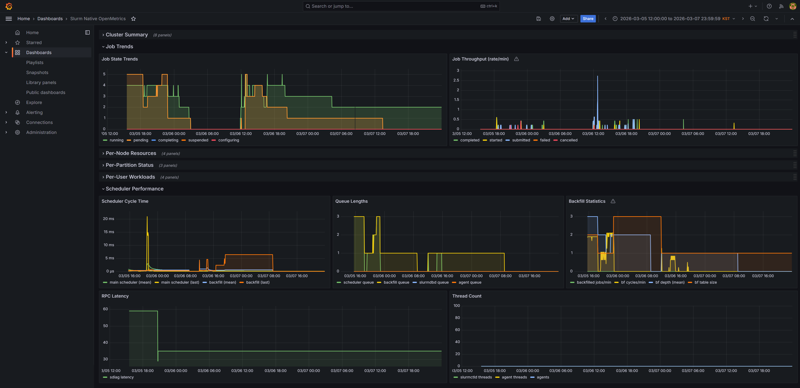

## TL;DR

Slurm 25.11부터 slurmctld가 직접 OpenMetrics(Prometheus 메트릭 표준 포맷) 형식으로 메트릭을 제공합니다. 기존에 `prometheus-slurm-exporter` 같은 별도 바이너리를 설치하고 squeue/sinfo를 파싱하던 방식이 더 이상 필요하지 않습니다. `slurm.conf`에 한 줄 추가하고, Prometheus의 scrape config만 작성하면 됩니다.

이 글에서는 실제 멀티 GPU 클러스터에서 이 기능을 구성한 과정을 공유합니다. 직접 만든 Grafana 대시보드도 [마켓플레이스에 등록](https://grafana.com/grafana/dashboards/24979-slurm-native-openmetrics/)하여 공유합니다.

---

## 기존 방식의 문제

Slurm 클러스터에 Prometheus 모니터링을 붙이려면 지금까지는 이런 구조였습니다:

```
slurmctld ← squeue/sinfo/sdiag ← prometheus-slurm-exporter(:9341) ← Prometheus ← Grafana
```

[vpenso/prometheus-slurm-exporter](https://github.com/vpenso/prometheus-slurm-exporter) 같은 별도의 exporter 바이너리가 주기적으로 `squeue`, `sinfo`, `sdiag` 등의 CLI 명령을 실행하고, 그 출력을 파싱해서 Prometheus 메트릭으로 변환하는 구조입니다. 잘 동작하지만 몇 가지 불편함이 있었습니다:

- **추가 바이너리 관리**: exporter를 별도로 빌드하거나 다운로드하고, systemd 서비스로 등록해야 합니다.
- **CLI 파싱의 한계**: squeue 출력 포맷이 바뀌면 exporter가 깨질 수 있습니다.
- **메트릭 정확도**: CLI를 주기적으로 호출하는 방식이라 exporter와 slurmctld 사이에 시차가 생깁니다.
- **유지보수 부담**: Slurm 버전이 올라갈 때마다 exporter도 호환성을 확인해야 합니다.

실제로 대표적인 exporter인 [prometheus-slurm-exporter](https://github.com/vpenso/prometheus-slurm-exporter)는 오랫동안 업데이트가 중단되었고, 이를 포크한 [rivosinc/prometheus-slurm-exporter](https://github.com/rivosinc/prometheus-slurm-exporter)나 [SckyzO/slurm_exporter](https://github.com/SckyzO/slurm_exporter) 등 여러 포크가 난립하는 상황이었습니다.

## 25.11에서 달라진 것

Slurm 25.11부터 slurmctld가 직접 HTTP 엔드포인트를 통해 OpenMetrics 1.0 스펙의 메트릭을 제공합니다:

```
slurmctld(:6817) /metrics/* ← Prometheus ← Grafana
```

exporter가 사라지고, slurmctld가 자신의 내부 상태를 직접 노출합니다. CLI 파싱이 아니라 내부 데이터를 그대로 내보내기 때문에 정확하고 빠릅니다.

공식 네이티브 메트릭이 도입됨에 따라, 커뮤니티 exporter들의 필요성은 자연스럽게 줄어들 것으로 보입니다. ([Slurm 25.11 릴리즈 노트](https://github.com/SchedMD/slurm/releases/tag/slurm-25-11-0-0rc1), [메트릭 가이드](https://slurm.schedmd.com/metrics.html))

## 설정 방법

### 1. slurm.conf

추가할 내용은 딱 한 줄입니다:

```ini
MetricsType=metrics/openmetrics
```

변경 후 slurmctld를 재시작합니다:

```bash
systemctl restart slurmctld
```

이제 slurmctld의 기본 포트(6817)에서 HTTP로 메트릭을 제공합니다.

### 주의사항

- **`PrivateData`가 설정되어 있으면 메트릭이 비활성화됩니다.** `slurm.conf`에 `PrivateData` 파라미터가 있다면 메트릭 기능이 동작하지 않습니다.
- **인증이 없습니다.** 누구나 slurmctld 포트에 HTTP 요청을 보낼 수 있으므로, 방화벽이나 네트워크 접근 제어가 필요합니다.
- **스크래핑 빈도에 주의하세요.** 메트릭 요청 시 slurmctld 내부 락을 잡기 때문에, 너무 짧은 간격으로 스크래핑하면 스케줄러 성능에 영향을 줄 수 있습니다. 공식 문서에서는 60~120초 간격을 권장합니다([메트릭 가이드](https://slurm.schedmd.com/metrics.html)).

### 2. 엔드포인트 확인

설정이 완료되면 curl로 바로 확인할 수 있습니다:

```bash
# List available endpoints
curl http://localhost:6817/metrics

# Job status
curl http://localhost:6817/metrics/jobs

# Node resources
curl http://localhost:6817/metrics/nodes

# Partition status
curl http://localhost:6817/metrics/partitions

# Scheduler performance
curl http://localhost:6817/metrics/scheduler

# Per-user/account jobs
curl http://localhost:6817/metrics/jobs-users-accts
```

응답 예시 (`/metrics/nodes`):

```
# HELP slurm_node_cpus Total number of cpus in the node
# TYPE slurm_node_cpus gauge
slurm_node_cpus{node="gpu-node-01"} 64
slurm_node_cpus{node="gpu-node-02"} 128
slurm_node_cpus{node="cpu-node-01"} 48
# HELP slurm_node_cpus_alloc Allocated cpus in the node
# TYPE slurm_node_cpus_alloc gauge
slurm_node_cpus_alloc{node="gpu-node-01"} 0
slurm_node_cpus_alloc{node="gpu-node-02"} 32
# EOF
```

### 3. 헬스체크 엔드포인트 (보너스)

25.11은 메트릭 외에도 HTTP 헬스체크 엔드포인트를 추가했습니다:

```bash
# slurmctld
curl http://localhost:6817/livez    # 프로세스 생존 확인
curl http://localhost:6817/readyz   # 요청 처리 가능 여부
curl http://localhost:6817/healthz  # 전반적 상태

# slurmd (port 6818 on each node)
curl http://<node-ip>:6818/livez
```

Blackbox Exporter와 조합하면 Slurm 데몬의 상태를 Prometheus에서 직접 모니터링할 수 있습니다.

### 4. Prometheus scrape config

`prometheus.yml`에 각 엔드포인트별 scrape job을 추가합니다. 엔드포인트별로 분리하면 필요에 따라 간격이나 타임아웃을 다르게 조정할 수 있습니다:

```yaml
scrape_configs:
  # 작업 상태 (running, pending, completed 등)
  - job_name: "slurm-native-jobs"
    scrape_interval: 60s
    metrics_path: "/metrics/jobs"
    static_configs:
      - targets: ["<slurmctld-host>:6817"]

  # 노드 리소스 (CPU, 메모리 할당)
  - job_name: "slurm-native-nodes"
    scrape_interval: 60s
    metrics_path: "/metrics/nodes"
    static_configs:
      - targets: ["<slurmctld-host>:6817"]

  # 파티션별 현황
  - job_name: "slurm-native-partitions"
    scrape_interval: 60s
    metrics_path: "/metrics/partitions"
    static_configs:
      - targets: ["<slurmctld-host>:6817"]

  # 스케줄러 성능 (backfill, 사이클 타임 등)
  - job_name: "slurm-native-scheduler"
    scrape_interval: 60s
    metrics_path: "/metrics/scheduler"
    static_configs:
      - targets: ["<slurmctld-host>:6817"]

  # 사용자/계정별 작업
  - job_name: "slurm-native-users-accts"
    scrape_interval: 60s
    metrics_path: "/metrics/jobs-users-accts"
    static_configs:
      - targets: ["<slurmctld-host>:6817"]
```

> **참고**: `/metrics/jobs-users-accts` 엔드포인트는 사용자 수에 비례하여 시계열이 늘어납니다. 사용자가 많은 클러스터에서는 scrape_interval을 넉넉하게 잡는 것이 좋습니다.

Prometheus 설정을 리로드합니다:

```bash
# Method 1: HTTP API
curl -X POST http://localhost:9090/-/reload

# Method 2: Signal
kill -HUP $(pidof prometheus)
```

Prometheus UI(`http://localhost:9090/targets`)에서 모든 타겟이 `UP` 상태인지 확인합니다.

## 제공되는 메트릭 총정리

### /metrics/jobs — 클러스터 전체 작업 현황

| 메트릭 | 설명 |
|---|---|
| `slurm_jobs_running` | 실행 중인 작업 수 |
| `slurm_jobs_pending` | 대기 중인 작업 수 |
| `slurm_jobs_completed` | 완료된 작업 수 |
| `slurm_jobs_failed` | 실패한 작업 수 |
| `slurm_jobs_cpus_alloc` | 할당된 총 CPU 수 |
| `slurm_jobs_memory_alloc` | 할당된 총 메모리 |
| `slurm_jobs_nodes_alloc` | 할당된 총 노드 수 |
| `slurm_jobs_timeout` | 타임아웃된 작업 수 |
| `slurm_jobs_outofmemory` | OOM으로 실패한 작업 수 |

이 외에도 `cancelled`, `completing`, `configuring`, `suspended`, `preempted` 등 Slurm의 모든 작업 상태가 메트릭으로 제공됩니다.

### /metrics/nodes — 노드별 리소스

| 메트릭 | 라벨 | 설명 |
|---|---|---|
| `slurm_node_cpus{node="..."}` | node | 노드 총 CPU |
| `slurm_node_cpus_alloc{node="..."}` | node | 할당된 CPU |
| `slurm_node_cpus_idle{node="..."}` | node | 유휴 CPU |
| `slurm_node_memory_bytes{node="..."}` | node | 총 메모리 |
| `slurm_node_memory_alloc_bytes{node="..."}` | node | 할당된 메모리 |
| `slurm_node_memory_free_bytes{node="..."}` | node | 가용 메모리 |
| `slurm_nodes_idle` | — | idle 상태 노드 수 |
| `slurm_nodes_mixed` | — | mixed 상태 노드 수 |
| `slurm_nodes_alloc` | — | allocated 상태 노드 수 |
| `slurm_nodes_down` | — | down 상태 노드 수 |
| `slurm_nodes_drain` | — | drain 상태 노드 수 |

### /metrics/partitions — 파티션별 현황

노드/작업 메트릭이 `{partition="..."}` 라벨과 함께 파티션 단위로 제공됩니다. 예를 들어:

- `slurm_partition_jobs_running{partition="batch"}` — batch 파티션의 실행 중 작업 수
- `slurm_partition_nodes_cpus_alloc{partition="batch"}` — batch 파티션의 할당된 CPU
- `slurm_partition_nodes_mem_alloc{partition="batch"}` — batch 파티션의 할당된 메모리

### /metrics/scheduler — 스케줄러 내부 성능

| 메트릭 | 설명 |
|---|---|
| `slurm_sched_mean_cycle` | 메인 스케줄러 평균 사이클 시간 (µs) |
| `slurm_bf_mean_cycle` | 백필 스케줄러 평균 사이클 시간 (µs) |
| `slurm_bf_cycle_last` | 마지막 백필 사이클 시간 |
| `slurm_bf_depth_mean` | 백필 탐색 깊이 평균 |
| `slurm_bf_queue_len` | 백필 큐 길이 |
| `slurm_schedule_queue_len` | 스케줄러 큐 길이 |
| `slurm_slurmdbd_queue_size` | slurmdbd 큐 사이즈 |
| `slurm_backfilled_jobs` | 백필된 총 작업 수 (누적) |
| `slurm_sdiag_latency` | RPC 응답 지연 시간 |
| `slurm_server_thread_cnt` | slurmctld 활성 스레드 수 |

### /metrics/jobs-users-accts — 사용자/계정별

사용자별(`{user="..."}`)과 계정별(`{account="..."}`) 작업 메트릭입니다:

- `slurm_user_jobs_running{user="alice"}` — alice의 실행 중 작업
- `slurm_user_jobs_cpus_alloc{user="alice"}` — alice가 사용 중인 CPU
- `slurm_account_jobs_pending{account="default"}` — default 계정의 대기 작업

이 엔드포인트는 사용자별 리소스 사용량을 추적하거나, 공정 분배(fairshare) 상황을 모니터링하는 데 유용합니다.

## 기존 Exporter와의 메트릭 이름 비교

기존 `prometheus-slurm-exporter`를 사용하고 있었다면, 메트릭 이름이 완전히 다르다는 점에 주의해야 합니다. 기존 Grafana 대시보드를 그대로 쓸 수 없고, 쿼리를 다시 작성해야 합니다.

| Legacy Exporter | 25.11 Native | Description |
|---|---|---|
| `slurm_cpus_alloc` | `slurm_jobs_cpus_alloc` | Total allocated CPUs |
| `slurm_cpus_idle` | `sum(slurm_node_cpus_idle)` | Total idle CPUs |
| `slurm_cpus_total` | `sum(slurm_node_cpus)` | Total CPUs |
| `slurm_nodes_alloc` | `slurm_nodes_alloc` | Allocated nodes (same name) |
| `slurm_nodes_idle` | `slurm_nodes_idle` | Idle nodes (same name) |
| `slurm_node_cpu_alloc` | `slurm_node_cpus_alloc` | Per-node CPU |
| `slurm_node_mem_alloc` | `slurm_node_memory_alloc_bytes` | Per-node memory |
| `slurm_scheduler_mean_cycle` | `slurm_sched_mean_cycle` | Scheduler cycle time |
| `slurm_scheduler_backfilled_jobs_since_start` | `slurm_backfilled_jobs` | Backfilled jobs count |
| `slurm_account_fairshare` | — | Not available in native |

> 노드별 메트릭(`slurm_node_*`)에는 `{node="..."}` 라벨이 붙고, fairshare 메트릭에는 `{account="...", user="..."}` 라벨이 붙습니다.

일부 메트릭은 이름만 다르고 일부는 체계가 완전히 다릅니다. 특히 파티션별, 사용자별 메트릭은 네이티브 쪽이 훨씬 풍부합니다. 반면 fairshare 메트릭은 아직 네이티브에 포함되어 있지 않습니다.

## Grafana 대시보드

Grafana Labs 대시보드 마켓플레이스에 등록된 기존 Slurm 대시보드는 모두 exporter 기반입니다:

- [SLURM Dashboard (#4323)](https://grafana.com/grafana/dashboards/4323-slurm-dashboard/)
- [Slurm DashboardV2 (#19835)](https://grafana.com/grafana/dashboards/19835-slurm-dashboardv2/)
- [Slurm Cgroups (#14587)](https://grafana.com/grafana/dashboards/14587-slurm-cgroups/)

25.11 네이티브 메트릭 기반 대시보드를 직접 구성하여 마켓플레이스에 등록했습니다:

- [Slurm Native OpenMetrics (#24979)](https://grafana.com/grafana/dashboards/24979-slurm-native-openmetrics/)

### 대시보드 구성

5개 섹션으로 구성했습니다:

**1. 클러스터 요약** — Running/Pending 작업, CPU/메모리 사용률, 노드 상태 요약을 stat 패널로 한눈에 보여줍니다.

주요 쿼리:
```yaml
# CPU utilization
sum(slurm_node_cpus_alloc) / sum(slurm_node_cpus)

# Memory utilization
sum(slurm_node_memory_alloc_bytes) / sum(slurm_node_memory_bytes)
```

**2. 작업 추이** — 시간에 따른 작업 상태 변화와 완료/시작/제출 비율을 timeseries로 보여줍니다.

```yaml
# Job completion rate per minute
rate(slurm_sdiag_jobs_completed[5m]) * 60
```

**3. 노드별 리소스** — 각 노드의 CPU/메모리 할당량과 사용률을 추적합니다. 특정 노드에 부하가 집중되는지 확인할 수 있습니다.

```yaml
# Per-node CPU utilization
slurm_node_cpus_alloc / slurm_node_cpus
```

**4. 사용자별 작업** — 어떤 사용자가 얼마나 리소스를 사용하고 있는지 stacked timeseries로 보여줍니다. 리소스 편중을 감지하는 데 유용합니다.

```yaml
# Show only non-zero values (reduce noise)
slurm_user_jobs_running > 0
slurm_user_jobs_cpus_alloc > 0
```

**5. 스케줄러 성능** — slurmctld의 내부 성능 지표입니다. 스케줄러 사이클 시간이 비정상적으로 길어지면 클러스터 처리량에 문제가 생길 수 있습니다.

```yaml
# Scheduler cycle time (µs)
slurm_sched_mean_cycle
slurm_bf_mean_cycle

# slurmdbd queue size (growing = problem)
slurm_slurmdbd_queue_size
```



대시보드는 [Grafana 마켓플레이스](https://grafana.com/grafana/dashboards/24979-slurm-native-openmetrics/)에서 Import할 수 있습니다.

## 정리

| 항목 | 기존 (Exporter) | 25.11 (Native) |
|---|---|---|
| 추가 바이너리 | 필요 | 불필요 |
| 데이터 수집 방식 | CLI 파싱 (squeue, sinfo) | slurmctld 내부 데이터 직접 노출 |
| Prometheus 설정 | 필요 | 필요 (동일) |
| 메트릭 정확도 | CLI 호출 주기에 의존 | 실시간 내부 상태 |
| 메트릭 범위 | 제한적 | 풍부 (파티션별, 사용자별, 스케줄러 상세) |
| 유지보수 | exporter 별도 관리 | Slurm 패키지에 포함 |
| Grafana 대시보드 | 마켓플레이스에 다수 | [마켓플레이스 등록 (#24979)](https://grafana.com/grafana/dashboards/24979-slurm-native-openmetrics/) |

Slurm 25.11의 네이티브 OpenMetrics는 아키텍처를 단순화하면서도 더 풍부한 메트릭을 제공합니다. 별도 exporter를 관리할 필요가 없어지고, slurmctld의 내부 상태를 있는 그대로 볼 수 있다는 점이 가장 큰 이점입니다.

다만 아직 초기 기능이라 인증이 없고, fairshare 같은 일부 메트릭이 빠져 있는 점은 향후 버전에서 개선되기를 기대합니다.

---

*이 글은 Slurm 25.11.2 + Prometheus 2.51 + Grafana 10.4 환경에서 작성되었습니다.*
