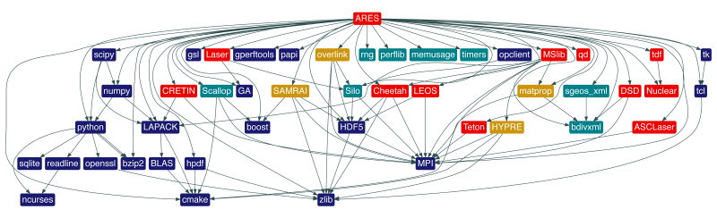

[Spack](https://spack.io)은 HPC에서 쓰이는 오픈소스 어플리케이션들의 설치를 도와주는 도구입니다. 현재의 오픈소스 SW들은 하나의 패키지(라이브러리)로 되어있는 것이 아니라 그림과 같이 많은 수의 패키지들이 복잡하게 상호 관계를 갖고 있습니다.

[^1]

또 사용하는 HW의 컴파일러, CPU 아키텍처에 따라 컴파일하는 옵션이 달라져야 하는 경우도 있습니다. 이런 복잡성을 체계적으로 관리하기 위한 도구로 [Spack](https://spack.io) 이 개발되었습니다. 이 글은 Spack의 튜토리얼이나 사용자 가이드의 목적으로 작성하지 않았습니다. 대신 Spack에 개발자로 기여하는 사례를 소개하고자 합니다. Spack은 수많은 오픈소스 SW(v0.19.2, '23년 4월 기준으로 약 7000개)를 설치할 수 있는데 이 글에서는 오픈소스 CFD SW중 하나인 Openfoam을 집중적으로 다루려고 합니다.

## Spack의 간단한 사용법
Spack에 대한 사용법으로도 글을 별도로 쓸 수 있지만 이 글에서는 정말 간략한 설명만 하겠습니다. Spack은 설치 과정이 간단합니다. 깃헙 리포지토리를 클론하고 환경변수 설정을 해주면 됩니다.

```bash
git clone -c feature.manyFiles=true https://github.com/spack/spack.git
. spack/share/spack/setup-env.sh
spack version
```

`spack info` 명령으로 패키지에 대한 설명을 볼 수 있습니다.

```bash
spack info openfoam
```


```bash
  Package:   openfoam

  Description:
    OpenFOAM is a GPL-opensource C++ CFD-toolbox. This offering is supported
    by OpenCFD Ltd, producer and distributor of the OpenFOAM software via
    www.openfoam.com, and owner of the OPENFOAM trademark. OpenCFD Ltd has
    been developing and releasing OpenFOAM since its debut in 2004.

  Homepage: https://www.openfoam.com/

  Preferred version:
    2206           https://sourceforge.net/projects/openfoam/files/v2206/OpenFOAM-v2206.tgz

  Safe versions:
    develop        [git] https://develop.openfoam.com/Development/openfoam.git on branch develop
    master         [git] https://develop.openfoam.com/Development/openfoam.git on branch master
    2206           https://sourceforge.net/projects/openfoam/files/v2206/OpenFOAM-v2206.tgz
    2112_220610    https://sourceforge.net/projects/openfoam/files/v2112/OpenFOAM-v2112_220610.tgz
    2112           https://sourceforge.net/projects/openfoam/files/v2112/OpenFOAM-v2112.tgz
    2106_220610    https://sourceforge.net/projects/openfoam/files/v2106/OpenFOAM-v2106_220610.tgz
    2106_211215    https://sourceforge.net/projects/openfoam/files/v2106/OpenFOAM-v2106_211215.tgz
    2106           https://sourceforge.net/projects/openfoam/files/v2106/OpenFOAM-v2106.tgz
    2012_220610    https://sourceforge.net/projects/openfoam/files/v2012/OpenFOAM-v2012_220610.tgz
    2012_210414    https://sourceforge.net/projects/openfoam/files/v2012/OpenFOAM-v2012_210414.tgz
    2012           https://sourceforge.net/projects/openfoam/files/v2012/OpenFOAM-v2012.tgz
    2006_220610    https://sourceforge.net/projects/openfoam/files/v2006/OpenFOAM-v2006_220610.tgz
    2006_201012    https://sourceforge.net/projects/openfoam/files/v2006/OpenFOAM-v2006_201012.tgz
    2006           https://sourceforge.net/projects/openfoam/files/v2006/OpenFOAM-v2006.tgz
    1912_220610    https://sourceforge.net/projects/openfoam/files/v1912/OpenFOAM-v1912_220610.tgz
    1912_200506    https://sourceforge.net/projects/openfoam/files/v1912/OpenFOAM-v1912_200506.tgz
    1912_200403    https://sourceforge.net/projects/openfoam/files/v1912/OpenFOAM-v1912_200403.tgz
    1912           https://sourceforge.net/projects/openfoam/files/v1912/OpenFOAM-v1912.tgz
    1906_200312    https://sourceforge.net/projects/openfoam/files/v1906/OpenFOAM-v1906_200312.tgz
    1906_191103    https://sourceforge.net/projects/openfoam/files/v1906/OpenFOAM-v1906_191103.tgz
    1906           https://sourceforge.net/projects/openfoam/files/v1906/OpenFOAM-v1906.tgz
    1812_200312    https://sourceforge.net/projects/openfoam/files/v1812/OpenFOAM-v1812_200312.tgz
    1812_191001    https://sourceforge.net/projects/openfoam/files/v1812/OpenFOAM-v1812_191001.tgz
    1812_190531    https://sourceforge.net/projects/openfoam/files/v1812/OpenFOAM-v1812_190531.tgz
    1812           https://sourceforge.net/projects/openfoam/files/v1812/OpenFOAM-v1812.tgz
    1806           https://sourceforge.net/projects/openfoam/files/v1806/OpenFOAM-v1806.tgz
    1712           https://sourceforge.net/projects/openfoam/files/v1712/OpenFOAM-v1712.tgz
    1706           https://sourceforge.net/projects/openfoam/files/v1706/OpenFOAM-v1706.tgz
    1612           https://sourceforge.net/projects/openfoam/files/v1612+/OpenFOAM-v1612+.tgz

  Deprecated versions:
    None

  Variants:
    Name [Default]            When    Allowed values    Description
    ======================    ====    ==============    ==================================================

    build_system [generic]    --      generic           Build systems supported by the package
    float32 [off]             --      on, off           Use single-precision
    int64 [off]               --      on, off           With 64-bit labels
    kahip [off]               --      on, off           With kahip decomposition
    knl [off]                 --      on, off           Use KNL compiler settings
    metis [off]               --      on, off           With metis decomposition
    mgridgen [off]            --      on, off           With mgridgen support
    paraview [off]            --      on, off           Build paraview plugins and runtime post-processing
    scotch [on]               --      on, off           With scotch/ptscotch decomposition
    source [on]               --      on, off           Install library/application sources and tutorials
    spdp [off]                --      on, off           Use single/double mixed precision
    vtk [off]                 --      on, off           With VTK runTimePostProcessing
    zoltan [off]              --      on, off           With zoltan renumbering

  Build Dependencies:
    adios2  boost  cgal  cmake  fftw-api  flex  kahip  m4  metis  mpi  paraview  parmgridgen  scotch  vtk  zlib  zoltan

  Link Dependencies:
    adios2  boost  cgal  fftw-api  flex  kahip  metis  mpi  paraview  scotch  vtk  zlib  zoltan

  Run Dependencies:
    None
```    



Openfoam 패키지에 대한 옵션들이 기술되어 있습니다. 버전 1612부터 2206까지 선택할 수 있고 다양한 의존 패키지(Dependencies) 및 설치 옵션(Variants)들이 기술되어 있습니다. 

설치 하기 전 `spack spec`명령을 통해 실제 어떤 패키지들이 설치될지 알 수 있습니다.

```bash
spack spec openfoam
```


```bash
  Input spec
  --------------------------------
  openfoam

  Concretized
  --------------------------------
  openfoam@=2206%gcc@=9.4.0~float32~int64~kahip~knl~metis~mgridgen~paraview+scotch+source~spdp~vtk~zoltan build_system=generic arch=linux-ubuntu20.04-cascadelake
      ^adios2@=2.9.0%gcc@=9.4.0+blosc+bzip2~cuda~dataspaces~fortran~hdf5~ipo~libpressio+mpi~pic+png~python+ssc+sst+sz+zfp build_system=cmake build_type=Release generator=make arch=linux-ubuntu20.04-cascadelake
          ^bzip2@=1.0.8%gcc@=9.4.0~debug~pic+shared build_system=generic arch=linux-ubuntu20.04-cascadelake
          ^c-blosc@=1.21.2%gcc@=9.4.0+avx2~ipo build_system=cmake build_type=Release generator=make arch=linux-ubuntu20.04-cascadelake
              ^lz4@=1.9.4%gcc@=9.4.0 build_system=makefile libs=shared,static arch=linux-ubuntu20.04-cascadelake
              ^snappy@=1.1.10%gcc@=9.4.0~ipo+pic+shared build_system=cmake build_type=Release generator=make arch=linux-ubuntu20.04-cascadelake
          ^gmake@=4.4.1%gcc@=9.4.0~guile build_system=autotools arch=linux-ubuntu20.04-cascadelake
          ^libfabric@=1.18.0%gcc@=9.4.0~debug~kdreg build_system=autotools fabrics=sockets,tcp,udp arch=linux-ubuntu20.04-cascadelake
          ^libffi@=3.4.4%gcc@=9.4.0 build_system=autotools arch=linux-ubuntu20.04-cascadelake
          ^libpng@=1.6.39%gcc@=9.4.0~ipo build_system=cmake build_type=Release generator=make libs=shared,static arch=linux-ubuntu20.04-cascadelake
          ^pkgconf@=1.9.5%gcc@=9.4.0 build_system=autotools arch=linux-ubuntu20.04-cascadelake
          ^sz@=2.1.12.2%gcc@=9.4.0~fortran~hdf5~ipo~netcdf~pastri~python~random_access+shared~stats~time_compression build_system=cmake build_type=Release generator=make arch=linux-ubuntu20.04-cascadelake
          ^zfp@=0.5.5%gcc@=9.4.0~aligned~c~cuda~fasthash~fortran~ipo~openmp~profile~python+shared~strided~twoway+utilities bsws=64 build_system=cmake build_type=Release generator=make arch=linux-ubuntu20.04-cascadelake
      ^boost@=1.82.0%gcc@=9.4.0+atomic+chrono~clanglibcpp~container~context~contract~coroutine+date_time~debug+exception~fiber+filesystem+graph~graph_parallel~icu+iostreams~json+locale+log+math~mpi+multithreaded~nowide~numpy~pic+program_options~python+random+regex+serialization+shared+signals~singlethreaded~stacktrace+system~taggedlayout+test+thread+timer~type_erasure~versionedlayout+wave build_system=generic cxxstd=98 patches=a440f96,a7c807f visibility=hidden arch=linux-ubuntu20.04-cascadelake
          ^xz@=5.4.1%gcc@=9.4.0~pic build_system=autotools libs=shared,static arch=linux-ubuntu20.04-cascadelake
          ^zstd@=1.5.5%gcc@=9.4.0+programs build_system=makefile compression=none libs=shared,static arch=linux-ubuntu20.04-cascadelake
      ^cgal@=4.13%gcc@=9.4.0~core~demos+eigen~header_only~imageio~ipo+shared build_system=cmake build_type=Release generator=make arch=linux-ubuntu20.04-cascadelake
          ^eigen@=3.4.0%gcc@=9.4.0~ipo build_system=cmake build_type=RelWithDebInfo generator=make arch=linux-ubuntu20.04-cascadelake
          ^gmp@=6.2.1%gcc@=9.4.0+cxx build_system=autotools libs=shared,static patches=69ad2e2 arch=linux-ubuntu20.04-cascadelake
          ^mpfr@=4.2.0%gcc@=9.4.0 build_system=autotools libs=shared,static arch=linux-ubuntu20.04-cascadelake
              ^autoconf-archive@=2023.02.20%gcc@=9.4.0 build_system=autotools arch=linux-ubuntu20.04-cascadelake
              ^texinfo@=7.0.3%gcc@=9.4.0 build_system=autotools arch=linux-ubuntu20.04-cascadelake
      ^cmake@=3.26.3%gcc@=9.4.0~doc+ncurses+ownlibs~qt build_system=generic build_type=Release arch=linux-ubuntu20.04-cascadelake
          ^ncurses@=6.4%gcc@=9.4.0~symlinks+termlib abi=none build_system=autotools arch=linux-ubuntu20.04-cascadelake
          ^openssl@=1.1.1t%gcc@=9.4.0~docs~shared build_system=generic certs=mozilla arch=linux-ubuntu20.04-cascadelake
              ^ca-certificates-mozilla@=2023-01-10%gcc@=9.4.0 build_system=generic arch=linux-ubuntu20.04-cascadelake
      ^fftw@=3.3.10%gcc@=9.4.0+mpi~openmp~pfft_patches build_system=autotools precision=double,float arch=linux-ubuntu20.04-cascadelake
      ^flex@=2.6.4%gcc@=9.4.0+lex~nls build_system=autotools patches=f8b85a0 arch=linux-ubuntu20.04-cascadelake
          ^autoconf@=2.69%gcc@=9.4.0 build_system=autotools patches=35c4492,7793209,a49dd5b arch=linux-ubuntu20.04-cascadelake
          ^automake@=1.16.5%gcc@=9.4.0 build_system=autotools arch=linux-ubuntu20.04-cascadelake
          ^bison@=3.8.2%gcc@=9.4.0 build_system=autotools arch=linux-ubuntu20.04-cascadelake
          ^diffutils@=3.9%gcc@=9.4.0 build_system=autotools arch=linux-ubuntu20.04-cascadelake
              ^libiconv@=1.17%gcc@=9.4.0 build_system=autotools libs=shared,static arch=linux-ubuntu20.04-cascadelake
          ^findutils@=4.9.0%gcc@=9.4.0 build_system=autotools patches=440b954 arch=linux-ubuntu20.04-cascadelake
          ^gettext@=0.21.1%gcc@=9.4.0+bzip2+curses+git~libunistring+libxml2+tar+xz build_system=autotools arch=linux-ubuntu20.04-cascadelake
              ^libxml2@=2.10.3%gcc@=9.4.0~python build_system=autotools arch=linux-ubuntu20.04-cascadelake
              ^tar@=1.34%gcc@=9.4.0 build_system=autotools zip=pigz arch=linux-ubuntu20.04-cascadelake
                  ^pigz@=2.7%gcc@=9.4.0 build_system=makefile arch=linux-ubuntu20.04-cascadelake
          ^help2man@=1.49.3%gcc@=9.4.0 build_system=autotools arch=linux-ubuntu20.04-cascadelake
          ^libtool@=2.4.7%gcc@=9.4.0 build_system=autotools arch=linux-ubuntu20.04-cascadelake
      ^m4@=1.4.19%gcc@=9.4.0+sigsegv build_system=autotools patches=9dc5fbd,bfdffa7 arch=linux-ubuntu20.04-cascadelake
          ^libsigsegv@=2.14%gcc@=9.4.0 build_system=autotools arch=linux-ubuntu20.04-cascadelake
      ^openmpi@=4.1.5%gcc@=9.4.0~atomics~cuda~cxx~cxx_exceptions~gpfs~internal-hwloc~java~legacylaunchers~lustre~memchecker~orterunprefix+romio+rsh~singularity+static+vt+wrapper-rpath build_system=autotools fabrics=none schedulers=none arch=linux-ubuntu20.04-cascadelake
          ^hwloc@=2.9.1%gcc@=9.4.0~cairo~cuda~gl~libudev+libxml2~netloc~nvml~oneapi-level-zero~opencl+pci~rocm build_system=autotools libs=shared,static arch=linux-ubuntu20.04-cascadelake
              ^libpciaccess@=0.17%gcc@=9.4.0 build_system=autotools arch=linux-ubuntu20.04-cascadelake
                  ^util-macros@=1.19.3%gcc@=9.4.0 build_system=autotools arch=linux-ubuntu20.04-cascadelake
          ^numactl@=2.0.14%gcc@=9.4.0 build_system=autotools patches=4e1d78c,62fc8a8,ff37630 arch=linux-ubuntu20.04-cascadelake
          ^openssh@=9.3p1%gcc@=9.4.0+gssapi build_system=autotools arch=linux-ubuntu20.04-cascadelake
              ^krb5@=1.20.1%gcc@=9.4.0+shared build_system=autotools arch=linux-ubuntu20.04-cascadelake
              ^libedit@=3.1-20210216%gcc@=9.4.0 build_system=autotools arch=linux-ubuntu20.04-cascadelake
              ^libxcrypt@=4.4.33%gcc@=9.4.0~obsolete_api build_system=autotools arch=linux-ubuntu20.04-cascadelake
          ^perl@=5.36.0%gcc@=9.4.0+cpanm+open+shared+threads build_system=generic arch=linux-ubuntu20.04-cascadelake
              ^berkeley-db@=18.1.40%gcc@=9.4.0+cxx~docs+stl build_system=autotools patches=26090f4,b231fcc arch=linux-ubuntu20.04-cascadelake
              ^gdbm@=1.23%gcc@=9.4.0 build_system=autotools arch=linux-ubuntu20.04-cascadelake
                  ^readline@=8.2%gcc@=9.4.0 build_system=autotools patches=bbf97f1 arch=linux-ubuntu20.04-cascadelake
          ^pmix@=4.2.3%gcc@=9.4.0~docs+pmi_backwards_compatibility~python~restful build_system=autotools arch=linux-ubuntu20.04-cascadelake
              ^libevent@=2.1.12%gcc@=9.4.0+openssl build_system=autotools arch=linux-ubuntu20.04-cascadelake
      ^scotch@=7.0.3%gcc@=9.4.0+compression~esmumps~int64~ipo~metis+mpi+shared build_system=cmake build_type=Release generator=make arch=linux-ubuntu20.04-cascadelake
      ^zlib@=1.2.13%gcc@=9.4.0+optimize+pic+shared build_system=makefile arch=linux-ubuntu20.04-cascadelake
```


Openfoam을 위해 flex, openmpi, boost, cgal, cmake, scotch등의 패키지가 설치되는 것을 알 수 있습니다. 아마 Openfoam을 컴파일하여 설치해본 경험이 있더라도 하위의 몇몇 패키지들은 rpm이나 deb같은 바이너리 패키지를 설치했을 것입니다. Spack은 하위의 모든 패키지들을 컴파일하여 설치하는 것이 기본입니다. 물론 컴파일 하지 않고 이미 다른 방법(yum/dnf, apt등)으로 설치한 패키지 파일이 있다면 그것을 활용하게 할 수도 있습니다.

설치 설정 시 각 의존 패키지들의 설정과 옵션 및 컴파일러를 선택할 수 있습니다. 아래 제공된 명령어는 OpenFOAM 버전 2206을 특정 옵션과 선택한 컴파일러로 설치하는 예시를 보여줍니다.

```bash
  spack install openfoam@2206~float32~int64~kahip~knl~metis~mgridgen~paraview+scotch+source~spdp~vtk~zoltan build_system=generic %gcc@9.4.0
```

이 명령은 모든 옵션을 쓴 것이라 복잡해 보이는데 defalut옵션과 동일하다면 그 옵션을 생략할 수 있고 보통 설치할 패키지의 버전과 컴파일러를 선택하여 설치하게 됩니다.

```bash
  spack install openfoam@2206 %gcc@9.4.0
```

명령을 실행하게 되면 `spec` 명령으로 확인했던 패지들이 모두 설치되며 컴파일하여 설치하므로 서버 환경에 따라 장시간(몇십분에서 몇시간) 소요가 됩니다.

## Spack 패키지 레시피 소개
그럼 info에 있던 버전 정의, 의존 패키지, variants정의는 어떻게 했을까요? 그건 Openfoam 커뮤니티에서  하지 않고 [Spack 리포지토리](https://github.com/spack/spack)에서 합니다. 이 설치에 대한 것은  `spack edit openfoam`명령으로 레시피 코드를 볼 수 있으며 파이썬 파일로 되어 있습니다. 파이썬이지만 DSL(Domain Specific Language)이라고 생각하면 됩니다. Spack 커뮤니티에서는 이를 패키지 레시피라고 하며 아래에 Spack 문서에서 제공하는 예제를 인용하였습니다. 다시 Spack을 정의내리면 오픈소스 SW의 설치 방법을 독자적인 언어로 레시피로 만들어 놓은 도구라고 할 수 있겠습니다. 

```python
class Openjpeg(CMakePackage):
    """OpenJPEG is an open-source JPEG 2000 codec written in C language"""

    homepage = "https://github.com/uclouvain/openjpeg"
    url = "https://github.com/uclouvain/openjpeg/archive/v2.3.1.tar.gz"

    version("2.4.0", sha256="8702ba68b442657f11aaeb2b338443ca8d5fb95b0d845757968a7be31ef7f16d")

    variant("codec", default=False, description="Build the CODEC executables")
    depends_on("libpng", when="+codec")

    def url_for_version(self, version):
        if version >= Version("2.1.1"):
            return super(Openjpeg, self).url_for_version(version)
        url_fmt = "https://github.com/uclouvain/openjpeg/archive/version.{0}.tar.gz"
        return url_fmt.format(version)

    def cmake_args(self):
        args = [
            self.define_from_variant("BUILD_CODEC", "codec"),
            self.define("BUILD_MJ2", False),
            self.define("BUILD_THIRDPARTY", False),
        ]
        return args
```

Example of package recipe[^2]

Spack 커뮤니티에서는 Spack을 사용하는 사용자를 일반 사용자, 개발자, 패키저(Packager)로 정의를 합니다. 패키저는 패키지 레시피를 개발하는 사람들로 코어 개발자와 구분하기 위한 것입니다. 오폰소스에 기여하고 싶은 사람들은 코어 영역에 기여하고 싶은 욕심도 있을 것입니다. 그러나 보통 유명한 오픈소스들의 코어 영역까지 건드리려면 그 오픈소스의 구조를 다 파악하고 있어야 하며 보수적인 테스트들과 리뷰가 통과되어야 적용이 되는데 처음 오픈소스에 기여하고 싶은 사람들에게는 올바른 접근이 아니라고 생각합니다. 작은 부분에 기여하거나 문서화 같은 부분도 오픈소스에 기여하는 것이라고 생각합니다. 그런 차원에서 Spack의 패키지 레시피에 기여하는 것도 오픈소스에 기여하는 것이라고 생각합니다.


## Openfoam 배포판 소개 및 패키지 레시피 현황
여기서 하나 Openfoam이 다른 오픈소스와 다른 점이 있습니다. Openfoam은 크게 세가지 버전으로 배포되고 각 버전을 관리하는 기관이 다릅니다. OpenFoam의 초기 개발자인 Henry Weller의 주관으로 [OpenFoam Foundation](http://openfoam.org)에서 배포하는 버전과 ESI OpenCFD에서 배포하는 [OpenCFD](http://openfoam.com) 배포이 있고 Hrvoje Jasak이 주관하는 [Foam-Extend](https://sourceforge.net/projects/foam-extend/)가 있습니다. 이 글에서는 각각 Foundation 배포판, OpenCFD 배포판, Extend 배포판으로 명명하겠습니다. 
Spack에서도 각각의 배포판이 모두 별개의 패키지로 등록이 되어있습니다. 그런데 패키지 레시피 코드를 뜯어 보면 OpenCFD 배포판 코드의 개발자가 다른 배포판도 개발하였습니다. 하지만 OpenCFD 배포판은 수시로 업데이트를 하는 반면에 다른 배포판은 업데이트가 잘 안되고 있었습니다. 그래서 저는 Foundation 배포판의 패키지 레시피를 주로 보완하기로 했습니다. 이제부터는 코드에 기여한 사례 별로 정리하였습니다.

### 첫번째 기여 (버전 정의)
이제 레시피 파일을 뜯어보면서 어떤 부분을 고쳐야할지 살펴봐야 합니다. 패키지 파일의 첫 부분 중 버전에 관련된 부분을 발췌했습니다.

```python
  class OpenfoamOrg(Package):
      ...

      homepage = "https://www.openfoam.org/"
      baseurl = "https://github.com/OpenFOAM"
      url = "https://github.com/OpenFOAM/OpenFOAM-4.x/archive/version-4.1.tar.gz"
      git = "https://github.com/OpenFOAM/OpenFOAM-dev.git"

      version("develop", branch="master")
      version(
          "10",
          sha256="59d712ba798ca44b989b6ac50bcb7c534eeccb82bcf961e10ec19fc8d84000cf",
          url=baseurl + "/OpenFOAM-10/archive/version-10.tar.gz",
      )
      version(
          "9",
          sha256="0c48fb56e2fbb4dd534112811364d3b2dc12106e670a6486b361e4f864b435ee",
          url=baseurl + "/OpenFOAM-9/archive/version-9.tar.gz",
      )
      version(
          "8",
          sha256="94ba11cbaaa12fbb5b356e01758df403ac8832d69da309a5d79f76f42eb008fc",
          url=baseurl + "/OpenFOAM-8/archive/version-8.tar.gz",
      )
      ...
      version(
          "5.0",
          sha256="9057d6a8bb9fa18802881feba215215699065e0b3c5cdd0c0e84cb29c9916c89",
          url=baseurl + "/OpenFOAM-5.x/archive/version-5.0.tar.gz",
      )
      ...
      version(
          "2.3.1",
          sha256="2bbcf4d5932397c2087a9b6d7eeee6d2b1350c8ea4f455415f05e7cd94d9e5ba",
          url="http://downloads.sourceforge.net/foam/OpenFOAM-2.3.1.tgz",
      )
      ...
```

여러 버전이 명시되어있고 sha256정보와 url 정보가 있습니다. 그런데 Spack 공식 문서를 보면 url을 스마트하게 찾아주기도 합니다.
아래의 코드와 설명을 읽어보면 url이 버전에 따라 정해진 형식이라면 알아서 찾아줍니다. Openfoam-org처럼 버전마다 url을 명시하는 것은 지저분하기 때문에 코드를 깔끔하게 바꿔줄 필요가 있습니다.

```python
  class Foo(Package):

      url = "http://example.com/foo-1.0.tar.gz"

      version("8.2.1", md5="4136d7b4c04df68b686570afa26988ac")
      version("8.2.0", md5="1c9f62f0778697a09d36121ead88e08e")
      version("8.1.2", md5="d47dd09ed7ae6e7fd6f9a816d7f5fdf6")
```

{}

By default, each version’s URL is extrapolated from the url field in the package. For example, Spack is smart enough to download version 8.2.1 of the Foo package above from [http://example.com/foo-8.2.1.tar.gz](http://example.com/foo-8.2.1.tar.gz).

{}

그런데 한가지 규칙에 어긋나는 부분이 5.0이하의 버전에서는 url의 suffix 중에 5.x같이 .x가 들어가는 특별한 규칙이 있는 것입니다. 이를 위해 함수 하나를 만들어서 해결하기로 합니다.

바뀐 부분은 아래와 같습니다. 원본에 비해 많이 깔끔해졌습니다.

```python
  class OpenfoamOrg(Package):
    ...
      homepage = "https://www.openfoam.org/"
      baseurl = "https://github.com/OpenFOAM"
      url = "https://github.com/OpenFOAM/OpenFOAM-6/archive/version-6.tar.gz"
      git = "https://github.com/OpenFOAM/OpenFOAM-dev.git"

      version("develop", branch="master")
      version("10", sha256="59d712ba798ca44b989b6ac50bcb7c534eeccb82bcf961e10ec19fc8d84000cf")
      version("9", sha256="0c48fb56e2fbb4dd534112811364d3b2dc12106e670a6486b361e4f864b435ee")
      ...
    ...

      def url_for_version(self, version):
          """If the version number is 5.0 or lower, the returned URL includes
          the ".x" suffix in the OpenFOAM directory name to reflect
          the old directory naming convention for these versions.

          """
          if version <= Version("5.0"):
              url= "https://github.com/OpenFOAM/OpenFOAM-{0}.x/archive/version-{1}.tar.gz"
              return url.format(version.up_to(-1), version)
    ...
```

참고로 파일의 sha256값을 알아야 되는데요. 대부분의 리눅스 환경에서는 sha256유틸이 있으므로 아래와 같이 얻어낼 수 있습니다.

```bash
sha256sum ./version-6.tar.gz
32a6af4120e691ca2df29c5b9bd7bc7a3e11208947f9bccf6087cfff5492f025  ./version-6.tar.gz
```

이제 [PR(Pull Request)](https://github.com/spack/spack/pull/37587)을 시도하겠습니다. 깃에 대한 설명을 이 글에서 하지는 않을건데요. PR은 내가 바꾼 부분을 공식 리포지토리에 요청하는 것입니다. 오픈소스는 많은 사람이 같이 개발하는 것이기 때문에 각자 개발한 것을 서로 바꾸려고 하면 금방 스파게티 코드가 됩니다. 그래서 오픈소스에도 주관 기관 또는 주 개발자가 있고 그 사람들이 최종적인 merge 권한이 있습니다. 오픈소스마다 PR에 대한 규칙, 철학이 다를 것입니다. 생각보다 merge하는 과정이 까다로운 오픈소스도 있어서 마냥 오픈소스면 자유로운 건지 알고 접근했다가 실망하는 사람도 있습니다. 저는 오픈소스라 하더라도 초기에 구조를 설계하고 리포지토리를 운영하는 초기 개발자들(보통 이 분들이 리포지토리의 주인이 됩니다)이 대단하다고 생각하고 하고 그 사람들의 방식을 따르는 것이 맞다고 생각합니다.

그런데 바로 통과 될 것이라고 생각과 달리 부정적인 리뷰가 달렸습니다.

{}
Hmmm. I confirmed/re-confirmed all of the explicit package versions.

While this works I am hesitant to approve because the url_for_version method is normally "complete" in that it provides a single location to determine the "standard" URLs for the package.
{}

url_for_version 방법을 쓴다면 모든 버전을 쓰도록 만들어야 하는데 if문이 하나만 있으니 완벽한 방법이 아니라는 것입니다.

그래서 아래와 같이 코드를 수정했습니다.

```python
    def url_for_version(self, version):
        """If the version number is 5.0 or lower, the returned URL includes
        the ".x" suffix in the OpenFOAM directory name to reflect
        the old directory naming convention for these versions.
        """
        if version == Version("2.3.1"):
            return "http://downloads.sourceforge.net/foam/OpenFOAM-2.3.1.tgz"
        elif version <= Version("5.0"):
            version_prefix = str(version.up_to(-1)) + ".x"
        else:
            version_prefix = version

        url = "https://github.com/OpenFOAM/OpenFOAM-{}/archive/version-{}.tar.gz".format(
            version_prefix, version
        )
        return url
```

조건문을 보완하여 모든 조건에 대해 출력값을 주게 바꾸어 좀 더 코드가 완결성을 갖게 만들었습니다. 이렇게 보완을 하고나니 리뷰가 통과되어 머지가 되었습니다. 처음 리뷰를 제가 정확하게 이해한것이네요. 기여한 코드가 별거 아니라고 생각할 수도 있지만 어쩌면 그래서 예시로 보여주기 적절한 것 같습니다. 이런 작은 기여도 실제 반영하려면 까다로운 절차를 겪게 됩니다. 

버전 명시 외에 더 개선 해야할 작업들이 보이기 시작했습니다. 이제부터는 다소 까다롭고 최소한 Openfoam을 직접 컴파일해서 설치해 본 적도 있어야 알 수 있는 부분을 해보겠습니다. 추가적으로 기여한 부분들에 대해서는 2편에 작성하겠습니다.

To be Continued :pray:

[2편 링크](/ko/post/spack_openfoam_contribution2)

[^1]: "Spack: A Flexible Package Manager for HPC Software", [https://computing.llnl.gov/projects/spack-hpc-package-manager](https://computing.llnl.gov/projects/spack-hpc-package-manager)
[^2]: Main Spack Documentation, https://spack.readthedocs.io
