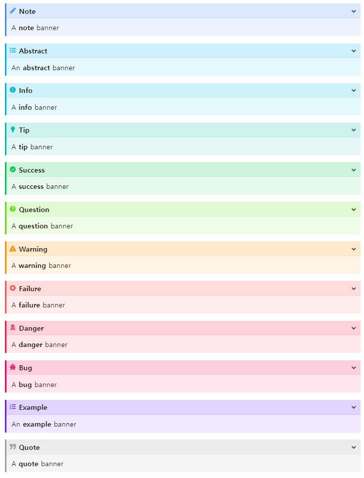

"Callout"이란 블로그에서 글을 작성하는 중에 특별히 강조하고 싶은 문구들을 블록으로 만들어서 강조 처리하는 것을 의미합니다.
Wowchemy의 [Callout문서](https://wowchemy.com/docs/content/writing-markdown-latex/#callouts)를 읽어보면 note와 warning만을 지원합니다.
아래는 Wowchemy에서 지원하는 Callout입니다.

{}
This is an example text.
{}

{}
This is an example text.
{}

종류가 두 개 밖에 없다는것이 매우 아쉽습니다. 

아래 그림은 [Doit테마](https://hugodoit.pages.dev)에서 Callout과 비슷하게 사용되는 admornition입니다. 12개를 지원하며 펼치기 기능도 지원합니다.



일단 Wowchemy에서 비슷한 시도가 있는지 검색해보았습니다. 
이 [이슈](https://github.com/wowchemy/wowchemy-hugo-themes/issues/1698#issuecomment-637773325)를 읽어보면 Custom으로 추가가 가능하다고 합니다.
하지만 Custom은 Hugo 테마라면 대부분 되는것이기 때문에 큰 장점은 아닙니다.

아쉬운대로 Cusotom하게 Callout을 추가해보았습니다.
Doit 테마를 참고하여 총 12개를 추가하려고 합니다. 
Callout의 요소는 크게 3가지입니다. 그것은 border, background, icon입니다. 

먼저 기준 색을 정하고 기준 색을 기반으로 4가지의 색을 정의하였습니다.


1. border-color: 경계 색으로 기준 색과 동일합니다.
2. icon-color: 아이콘 색으로 기준 색과 동일합니다.
3. (light) background-color: light테마에서 배경색으로 기준 색보다 25% 밝습니다.
4. (dark) background-color: dark테마에서 배경색으로 기준 색보다 25% 어둡습니다. 

그리고 icon도 각 callout별로 다른 것이 적용될수 있게 하였습니다.

최종적으로 `assets/scss/custom.scss`에 아래와 같이 추가하였습니다. 

```css
$callout-icon: (
  'note-admon': '\f304',
  'abstract': '\f1ea',
  'info': '\f129',
  'tip': '\f084',
  'success': '\f164',
  'question': '\f128',
  'warning-admon': '\f071',
  'failure': '\f7a9',
  'danger': '\f12a',
  'bug': '\f188',
  'example': '\f0d0',
  'quote': '\f10e',
);

$callout-color-map: (
  'note-admon': #448aff,
  'abstract': #00b0ff,
  'info': #00b8d4,
  'tip': #00bfa5,
  'success': #00c853,
  'question': #64dd17,
  'warning-admon': #ff9100,
  'failure': #ff5252,
  'danger': #ff1744,
  'bug': #f50057,
  'example': #651fff,
  'quote': #9e9e9e,
);

@each $key, $color in $callout-color-map {
  .alert-#{$key} {
    font-size: 0.9rem;
    border-color: $color;
    background-color: adjust-color($color, $lightness: 25%);
  }

  .dark .alert-#{$key} {
    color: #FFFFFF;
    background-color: adjust-color($color, $lightness: -25%);
  }

  div.alert-#{$key} > div:first-child::before {
    font-size: 0.9rem;
    top: 0.0rem;
    color: $color;
  }
}

@each $key, $icon in $callout-icon {
  div.alert-#{$key} > div:first-child::before {
    content: $icon;
  }
}
``` 

추가한 후에 Callout은 아래와 같습니다.

{}
이것은 note 타입입니다.
{}
{}
이것은 abstarct 타입입니다.
{}
{}
이것은 info 타입입니다.
{}
{}
이것은 tip 타입입니다.
{}
{}
이것은 success 타입입니다.
{}
{}
이것은 question 타입입니다.
{}
{}
이것은 warning 타입입니다.
{}
{}
이것은 failure 타입입니다.
{}
{}
이것은 danger 타입입니다.
{}
{}
이것은 bug 타입입니다.
{}
{}
이것은 example 타입입니다.
{}
{}
이것은 quote 타입입니다.
{}


이 정도까지 된것도 만족스럽지만 뭔가 아쉬움이 남습니다. 하지만 HTML과 CSS에 대한 기본 지식이 적다 보니 더 만드는 것에 한계가 왔습니다.  아래와 같은 사항을 할 일로 남겨놓고 정리하려고 합니다.

1. Callout 대신 별도의 Shortcode로 만듦
2. 펼치기 기능
3. 제목 기능 
4. Border 중 왼쪽만 들어가게
5. Shortcode 배포

