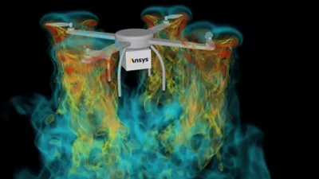
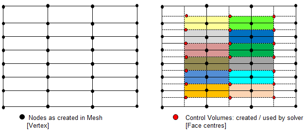
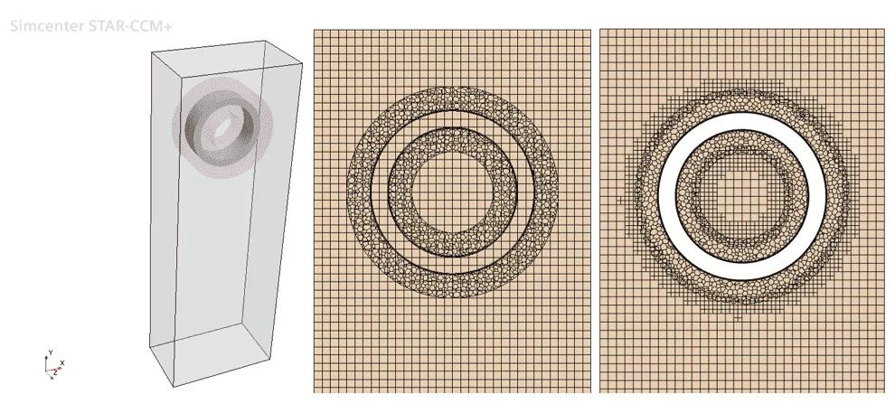

논문 링크: https://scienceon.kisti.re.kr/commons/util/originalView.do?cn=JAKO201713842134307&oCn=JAKO201713842134307&dbt=JAKO&journal=NJOU00290662

[EFD-CFD 워크샵](https://efd-cfd.gitbook.io/efd-cfd-workshop/)은 교수님들과 항공우주연구원의 연구자분들이 주도하에 개최가 된것입니다.
그렇다면 워크샵의 참여자를 생각해보면 일단 항공우주연구원, 국방과학연구원 같은 정출연은 참석할겁니다.
이런 연구소들은 연구인력들의 수준이 아주 높고 인하우스 코드들도 보유하고 있습니다.
또 당연히 대학원을 생각할 수 있습니다.

대학은 랩에 따라 논문이나 발표의 질이 다르긴 합니다. 또 거의 인하우스 코드로 참여하리라 예상이 되었습니다.
대학원의 인하우스 코드는 수년에서 수십년동안 연마된것이기 때문에 
인하우드 코드의 장점 위주로 설명을 하지 않을까 싶었습니다.
또 한편으로는 상용 CFD SW의 기술지원회사에서 참석하리라 생각했습니다.
여기는 자신들의 상용코드로 해석이 정확도가 잘 맞다고 주장할 것입니다.

이런 참석자들이 예상이 되었고 저는 어떤 선택을 했어야 할까요?
일단 당시의 회사에서는 인하우스 코드를 보유하고 있지 못했습니다. 
대신 다른 기관에 비해 다른 점은 다양한 해석 SW에 접근이 가능한 것이었습니다.
회사에서는 한 분야라 하더라도 하나의 상용SW만 구매하지 않고 여러 SW를 구매합니다. 
그래서 저는 가급적 많은 코드를 사용하여 비교하자를 목표로 삼았습니다.
다른 기관들은 논문당 하나의 코드로 해석할게 뻔했거든요.

이 글에서는 논문에 실었던 4개의 CFD SW들의 이야기를 해보려고 합니다.

# 1. Ansys Fluent
일단 Ansys사의 [Fluent](https://www.ansys.com/products/fluids/ansys-fluent)는 제가 주력으로 사용하던 SW였고 가장 자신있게 할 수 있었습니다.
Ansys에 인수된것은 2006년이고 이 때 부터는 "Ansys Fluent"가 정확한 Full Name입니다.
Fluent는 CFD 업계에서 수십년동안 마켓쉐어 1등을 지키고 있는 제품입니다.
명성답게 수많은 유체분야의 해석이 가능하고 강력한 병렬 성능도 가지고 있습니다.
사실 이 논문을 썼던 2017년만 하더라도 솔버는 강력하나 UI적으로는 불편한 면이 있었으나 매년 업데이트로 UI적인면도 크게 개선하여 2020년쯤에는 크게 특별히 불편하지 않았습니다.
2020년 이후로도 눈에 띄는 업데이트를 해왔는데 그 중 저와 관련이 있고 큰 관심이 있는 것만 아래에 간략히 담아보았습니다.
각각의 항목도 하나씩 이야기할거리가 있겠지만 현재 회사에서는 Fluent를 할 라이센스가 없어 제대로 된 분석을 할수는 없겠네요.

## 1-1. Python 도입
CFD 코드는 계산속도가 매우 중요한 분야이기 때문에 코어 영역은 C++이나 Fortran으로 하는 경우가 대부분입니다.
그런데 오로지 C++같은 코드로만 만들면 코드를 이용한 활용이 어려워집니다.
예를 들면 이 코드를 이용한 배치 작업을 만든다든지 표를 만든다느지 하는 외부작업과의 연결이 어려워집니다.
그래서 Python이나 Perl과 같은 스크립트류의 언어를 결합하는 경우가 많습니다.
보통 CFD를 전공한 사람들은 인하우스 CFD 코드를 접하므로 코드에 익숙하지만 회사에서 상용 SW만을 쓰게 되면 코드를 직접 볼 일이 없으므로 코딩 능력이 퇴화하게 됩니다.
그러나 상용 SW도 고급 단계의 숙련도를 가지려면 그 SW에서 지원하는 스크립트 언어를 익혀서 SW를 자유자재로 쓸 줄 알아야 합니다.
다시 손놓았던 코드를 해야되고(그것도 익숙하지 않은 프로그래밍언어일 것입니다) 여기서 일부 해석 인력들은 도태되고 맙니다.

Fluent는 이 스크립트 지원에 문제가 있었는데요.
Fluent의 스크립크 언어는 [Scheme](https://en.wikipedia.org/wiki/Scheme_(programming_language))입니다.
Scheme은 함수형언어인 Lisp의 일종인데 프로그래밍 언어의 역사적으로는 큰 의미가 있는 언어이나 현재는 사용률이 매우 떨어진 언어입니다.
게다가 CFD하는 사람들은 컴퓨터 공학의 전공자가 아니므로 이런 함수형 언어를 잘 다룰 가능성은 제로에 가깝습니다.
웹에서의 자료도 매우 적고요. 이것이 Fluent가 갖고 있는 몇 안되는 약점이었습니다.
이번에 Python으로 지원을 하면서 이 약점마저 극복하는 모습입니다.
저는 Python을 꽤 오래전부터 해왔고 매우 좋아했습니다.
제가 계속 Fluent를 할 수 있더라면 Python지원은 날개를 다는 수준이었을텐데 아쉬움이 남습니다. 
관련 내용은 Ansys 블로그 [Providing Open-Source Access to Ansys Fluent with PyFluent](https://www.ansys.com/blog/open-source-access-to-fluent-with-pyfluent)에 자세히 설명이 되어 있습니다.

## 1-2. GPU 지원

AI/ML분야에서는 GPU를 가속기로 사용하는 것이 일반화되어있습니다.
하지만 CFD 분야에서는 GPU 가속이 어려운 분야였습니다.
매우 쉽게 설명하면 이렇습니다.
CPU의 스펙을 이야기할 때 보통 아키텍쳐 세대, 클럭수와 코어수를 이야기합니다.
CFD로 사용하는 서버는 일반적으로 3.0MHz이상의 클럭수와 30코어이상의 서버를 사용합니다.
GPU는 아키텍쳐 세대, 메모리로 많이 이야기하지만 GPU도 사실 코어를 갖고 있습니다. Nvidia에서는 Cuda 코어라고 따로 부릅니다.
예를 들어 Nvidia V100 1장에는 5210 Cuda코어가 있습니다.
물론 CPU의 코어와 GPU의 코어가 같은 역할, 성능을 보여주는건 아닙니다.
비유를 하면 CPU의 코어가 대학생이라면 GPU의 코어는 초등학생입니다.
서로 싸움을 하는데 줄다리기 같은거라면 아무리 대학생 1명이 힘이 세더라도 초등학생 100명을 이길 수는 없습니다.
그런데 미적분 문제 같은거였다면 어떨까요? 100, 1000명의 초등학생이 와도 풀 수가 없습니다.
기존 CFD 문제는 미적분문제 같은거였다고 합시다. 그래서 초등학생에 해당하는 GPU의 코어로는 제대로 성능을 낼 수가 없었던 것입니다.
이것을 해결하려면 문제를 매우 쉽게 쪼개서 초등학생도 할 수 있게 만들어야 합니다.
그런데 지금까지는 기존 레거시 코드를 이리 저리 바꿔도 성공하는 사람은 거의 없었습니다.
그래서 해결한 방법은 차라리 코드를 새로 짜는것 이었습니다.
사실 위에서 설명한 초등학생,대학생,미적분과 같은 비유는 실제 CFD 수치해석 기법과 딱 들어맞는 이야기는 아닙니다.
제가 말하고 싶은 것은 제대로 된 GPU 가속을 위해서는 CFD 코드를 처음부터 다시 짜는 수밖에 없는 것 처럼 보인다는 것입니다. 
Fluent의 GPU솔버의 자세한 세부 코드는 알 수가 없지만 아마 새롭게 코드를 만들었을 것이고 그래서 생각보다 릴리즈하는데 시간이 걸린 것 같습니다.
관련 내용은 Ansys 블로그 [Unleashing the Power of Multiple GPUs for CFD Simulations](https://www.ansys.com/blog/unleashing-the-power-of-multiple-gpus-for-cfd-simulations)에 자세히 설명이 되어 있습니다.

# 2. Ansys CFX
CFX도 Fluent와 같이 Ansys사가 보유한 CFD SW입니다.
왜 같은 회사에 CFD SW가 두개인지에 대해 의문이 있을 수 있습니다.
보통 일반적으로 대부분의 분야에서는 Fluent를 사용하고 터보기계분야에서는 CFX로 하라는 조언이 많습니다.
그런데 사실 Fluent(2006년)보다도 CFX(2003년)가 먼저 Ansys사에 인수되었습니다.
어쩌면 늦게 들어온 Fluent에 의해 2인자로 물러난 것입니다.  
현재는 CFX는 거의 업데이트가 되지 않고 Fluent 위주로 업데이트가 되고 있습니다.
그런데 이렇게만 설명하기에는 뭔가 부족합니다.
사실 CFX는 굉장히 독특한 수치해석 기법을 갖고 있습니다.

## 2-1. Pressure based coupled solver
유체역학은 결국 유체의 압력, 속도, 밀도등을 풀어내는 것입니다. 
이 방정식이 내비어 스톡스 방정식인데 워낙 복잡한 관계로 여러가지 풀이법이 있습니다.
크게 압력 기반이냐 밀도 기반이냐 나눌 수 있습니다.
압력 기반으로 가게 되면 방정식은 압력, 속도 3개외 다른 변수들을 각각의 독립된 방정식에서 풀어냅니다.
그래서 방정식이 나누어져 있으므로 Segregated Solver라고도 합니다.
밀도 기반은 이에 반해 밀도, 운동량(속도)를 동시에 풀 수 있습니다.
그래서 밀도 기반 솔버는 Coupled Solver라고 합니다.
압력기반 솔버는 비압축성(마하수가 낮은 영역), 밀도기반 솔버는 압축성(마하수가 높은 영역)영역에 맞도록 개발되어 왔습니다.
그 하위의 수치해석기법들도 서로 다르게 개발이 된것도 많습니다.
CFX는 이와 또 다르게 압력 기반으로 되어 있으면서 방정식은 커플되어 있는 Coupled Solver입니다. 
이렇게 한 이유는 압력기반 솔버임에도 압축성 영역을 잘 해결할 수 있도록 한 것입니다.
Fluent는 이와 다르게 압력기반 솔버와 밀도기반 솔버 두개가 모두 내장되어 선택하여 쓸 수 있습니다.

## 2-2. Node based(cell-vertex code)
Flunet나 다른 솔버들은 Cell Centered 솔버인데 CFX는 Node(vertex) based 솔버라고 합니다.
이것은 그림으로 가장 잘 설명한 것은 아래 그림입니다.
먼저 격자점을 Node=Vertex라고 하고 Node 4개(hexa), 3개(tetra)로 Cell이 구성됩니다.
Cell Center방식은 이 Cell에 유동 데이터를 저장합니다.
Node Center방식은 Node에 유동 데이터를 저장합니다. 
대신 이 Node들에서 별도의 Polyhedral을 생성하여 계산이 됩니다.
이러면 적은 격자를 쓰더라도 충분히 정확한 결과를 보여준다고 합니다.

CFX의 특별한 점은 아래 링크에 더 자세한 설명이 있습니다.

[CFX vs. FLUENT(cfd-online)](https://www.cfd-online.com/Forums/cfx/166388-cfx-vs-fluent.html)

[SOLVER SETTING FOR CFD SIMULATIONS](http://www.cfdyna.com/CFDHT/SolverSetting.html)

[Ansys CFX 수치해석 기법 및 특징(태성에스엔이)](https://m.blog.naver.com/PostView.naver?isHttpsRedirect=true&blogId=tsne1234&logNo=221193360368)

이런 독특한 점에도 불구하고 현재는 많이 사용되고 있지않은 아쉬운 SW입니다. 
압축성 영역(마하수가 높은 영역)에서 밀도기반 솔버에 비해 생각만큼 해석이 잘 되는 것은 아닙니다.
여기서 해석이 잘된다는 의미는 해석의 속도가 빠른가, 성긴 격자에서도 수렴이 잘되는가 같은 특징에서입니다.
물론 이런 특징은 독특한 수치 기법에 따른 것도 있겠지만 제 개인적인 생각으로 같은 회사에 1등 SW인 Fluent가 있어
개발에 제한이 있는 이유가 더 큰 이유라고 생각합니다.
같은 라이센스로 두 SW가 가능하지만 Ansys사가 Fluent 위주로 개발을 해서 회사에서는 거의 사용한 적은 없었습니다.
저는 대학원에서 접했었고 이번에 옛 기억을 되살려서 CFX도 해보기로 하였습니다.

# 3. Star-CCM+
지멘스에서 개발한 [Star-CCM+](https://plm.sw.siemens.com/en-US/simcenter/fluids-thermal-simulation/star-ccm/)은 Fluent와 같이 CFD 분야에서 가장 많이 사용하는 SW중 하나입니다.
Star-CCM+은 본래 CD-Adapco란 Star-CCM+만을 개발하는 회사에서 개발을 하였는데 2016년에 지멘스로 인수가 되었습니다.
Star-CCM+은 Fluent에 비해 차별화되는 장점이 있었고 그런 장점을 저도 좋아했기에 Star-CCM+으로도 굉장히 많이 해석을 했었습니다.
단 Star-CCM+과 Fluent가 서로의 장점을 흡수하면서 현재는 어떤 것을 선택해도 무방한 상황이 아닌가 싶습니다.
그럼에도 두가지의 특징을 추려봤습니다.

# 3-1. Overset Mesh
Overset Mesh는 격자끼리 겹침을 허용하는 격자입니다. 
보통은 격자들끼리 겹쳐있을 필요는 없으나 움직이는 물체에 대해서 비정상 해석을 하거나 정상 해석을 하더라도 형상이 아주 복잡할 경우 격자 생성이 매우 어렵습니다.
이럴 때 Overset Mesh를 활용하면 쉽게 격자를 생성 할 수 있습니다.
단 겹치는 부분에 대해서 적절한 interpolation 방법을 선택해야 하므로 잘못사용하면 오히려 계산시간이 늘어나고 부정확한 결과를 보여줄 수 있습니다.
Star-CCM+은 2010년대 초반부터 Overset Mesh를 적용하였습니다.
사실 Fluent도 2010년대 중반에 Overset Mesh가 도입이 되어서 Star-CCM+만의 독창적인 특징은 아니게 되었습니다.
단 같은 기능으로 보이더라도 세부적으로 뜯어보면 더 많은 기능들이 들어가 있고 수치적인 안정성, 속도등도 고려하여야만 비교를 할 수 있습니다.
세부 고급 기능 중의 하나가 이 블로그 글 [Overset mesh with AMR, some interesting notes](https://volupe.se/overset-mesh-with-amr-some-interesting-notes)에 소개되어 있습니다.

# 3-2. 구조 해석 솔버
3-1의 Overset처럼 이제 Fluent와 Star-CCM+은 단순 기능 비교로는 거의 동등하게 보여 우열을 가리기 힘들게 되었습니다. 
그래서 Star-CCM+만의 차별성이 무엇일까에 대해서 고민을 했는데요. 
Ansys의 Fluent와 확실히 차이되는점이 있습니다.
Ansys는 수많은 회사들을 인수하면서 성장을 했는데요. 그러다보니 CFD에 필요한 전처리, 후처리도 Fluent외 별도의 특화 SW가 있습니다. 
구조 해석은 Ansys Mechanical이라고 하며 이 구조해석 SW 에서 시작한 회사입니다.
그러다 보니 그 수많은 회사들을 직접적으로 하나의 UI로 통합하다기 보다는 워크벤치라고 하는 인터페이스 툴이 별도로 있습니다.
이렇게 되면 사용자 입장에서는 CFD를 하더라도 전처리, 해석, 후처리에 대해서 각각 다른 3개의 SW를 사용하는 경우도 있습니다.
그에 비해 Star-CCM+은 본래 CD-Adapco란 CFD만 전문으로 하는 회사에서 시작했기 때문에 전/후처리 SW가 포함이 되어있습니다.
하나의 창에서 모든 CFD 작업을 할 수 있는것이 큰 장점이라 할 수 있습니다.
CFD에서는 구조 해석이 추가로 필요한 경우도 있는데 Fluent는 같은 회사의 Mechanical을 사용하는 것이 가장 좋습니다.
하지만 Star-CCM+은 구조 해석 솔버도 별도의 SW가 아닌 하나의 창 안에서 해결가능하도록 내장이 되어 있습니다.
그리고 구조 해석 솔버에서도 접촉과 같은 [고급기능](https://blogs.sw.siemens.com/simcenter/fluid-structure-interaction-fsi-with-mechanical-contact-in-one-simulation-yes-in-one/)들도  지원하려고 합니다.
사실 Fluent도 자체 후처리가 가능하고 내장된 별도의 구조 해석 솔버가 있는데 2020년때만 해도 Ansys가 보유한 다른 전용 SW에 비해서 기능이 많이 부족했었습니다.

# 4. SU2

3개의 상용 CFD 코드를 선택한 후 오픈소스 하나 쯤은 있어야 하지 않나라고 생각했습니다.
CFD에서 가장 유명한 오픈소스는 OpenFoam이나 본 논문에서는 SU2를 선택하였습니다.
OpenFoam은 2017년쯤만 해도 마하수가 높은 압축성 솔버의 해석의 수렴성이 좋지 않았었습니다.
수치해석의 해가 수렴이 되지 않고 발산이 되는 경우가 많다는 것이었습니다.
물론 오픈소스이기때문에 직접 개선하여도 되나 본 논문에서는 개선하여 비교를 하게 되면 오히려 올바른 비교가 안될 수 있어서
네이티브 한 상태로 해석을 해야됐었습니다.
SU2는 OpenFoam과 다르게 처음부터 압축성 솔버로 되어있어 해석하기 적합했습니다.
참고로 오히려 마하수가 낮은 문제는 잘 해석이 안되었습니다.
이 때는 발산되지는 않고 해석값이 아주 큰 폭으로 진동을 하게 되는 경우가 많습니다. 역시 수렴이 된다고 할 수 없는 상태로요.
SU2는 본래 스탠포드 공기역학 연구실에서 개발한 인하우스 코드인데 2012년부터 오픈소스 화하여 공개가 되었습니다.
태생이 공기역학 분야이다 보니 그 분야의 해석을 하기 매우 적합하지만 아직 범용적인 활용은 오픈폼에 비해서는 적은 것 같습니다.
솔직히 제가 SU2에 관심을 가졌던 것은 나만의 전문적인 스킬을 키우고자 하여 남들이 잘 쓰지 않는 코드를 택한 이유가 있었습니다.
그러나 한국에서는 비주류이다 보니 오히려 성장하기 힘들었던 점도 있었습니다.

---
여기까지만 해도 꽤 긴 글이 되었네요. 
더 하고 싶은 이야기가 있어 별도의 글로 작성하려고 합니다.
