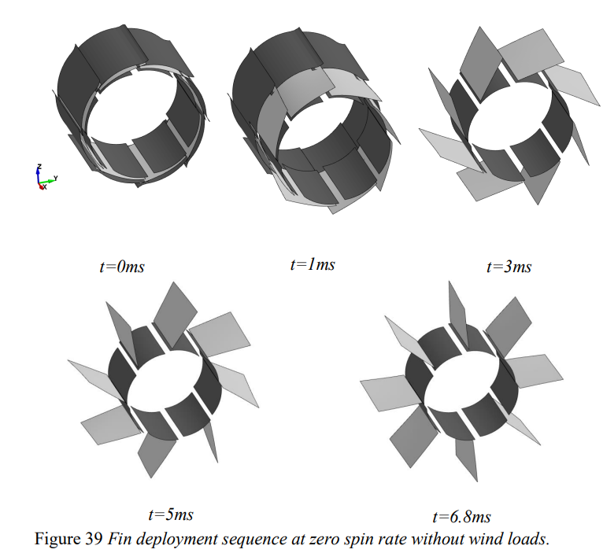
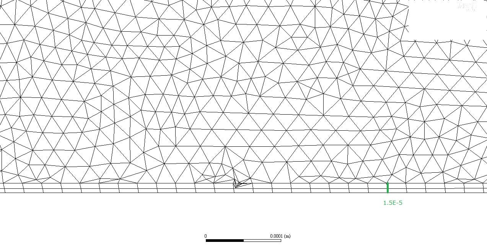

- 날개 전개
- 유체-구조 연계

논문에서는 성공한 사례만 담고 실패하거나 어려웠던 경험 들은 싣지 않는 경우가 많습니다. 이 논문을 쓸 때 어려운 난관이 있었는데 그런 난관에 대해서는 차마 논문에 싣지 못하였고 원활하게 해석을 한 것처럼 작성을 하였습니다. 그래서 이 글에서는 논문에 미처 쓰지 못한 이야기를 하려고 합니다.

유도탄이 항공기와의 다른 점 중 하나는 날개를 위한 공간이 충분하지 않다는 것입니다. 그래서 어쩔 수 없이 날개의 크기는 최소화되어 어딘가에 수납이 되어있어야 하는 경우가 많습니다. 수납이 되어 있다면 반드시 날개가 전개가 되어야 합니다. 전개는 탄성력을 가진 스프링을 이용하거나 원심력을 이용하는 경우가 많습니다. 이 논문에서도 탄성력을 이용하는데 스프링같은 장치가 있는 것이 아니라 날개 자체가 하나의 스프링처럼 휘어진 채로 수납이 되고 그 탄성력으로 날개 전개가 됩니다. 이런 날개를 가지기 위해서는 얇으면서도 튼튼한 강도를 가지고 있어야 되고요. 또 회전을 하고 있어 원심력도 작용을 합니다. 공력(공기역학)은 댐퍼의 역할로 쓰이게 됩니다. 아래 그림은 이 논문에서 참조한 논문[^1]에서 발췌한 그림입니다.

정리하면 날개 전개의 시뮬레이션을 위해서 탄성력을 모사하기 위한 구조 해석, 원심력을 모사하기 위한 동역학 해석, 공력을 모사하기 위한 전산유체역학 해석이 필요합니다. 보통 이런 해석은 난이도가 굉장히 높은 해석입니다. 왜냐하면 각각의 역학을 해석하기 위한 SW가 별도로 있고 그것을 연동하기 위한 것이 쉬운 것이 아니기 때문입니다. 그래서 세가지 해석을 동시에 하기 어렵기 때문에 보통은 한가지 역학의 해석 SW를 정하고 다른 역학은 여러 가정을 들어 단순화하여 반영합니다. 저는 호기롭게 이 세가지 해석을 동시에 하기로 마음을 먹었습니다. 특히 유체와 구조를 연동하여 해석하는 경우를 [유체구조 연계해석](https://www.banditong.com/cae-dict/fluid_structure_coupled_analysis)(Fluid Structure Interaction, FSI)이라고 하며 전산유체역학 해석분야에서 가장 난이도가 높은 해석중에 손꼽히는 해석입니다. 저는 학생이던 시절부터 FSI해석을 매우 좋아했고 열심히 했던 분야였습니다. 아래 그림은 FSI 케이스 중 유명한 Turek-Hron Case[^2]입니다.

")

본격적으로 논문을 진행하기 위해 해석 SW의 선정이 필요했는데요. 먼저 유체 해석에서는 가장 자신 있었던 [Ansys Fluent](https://www.ansys.com/products/fluids/ansys-fluent)를 선택했습니다. Fluent를 선택하게 되면 구조 해석 SW는 같은 회사의 제품인 [Ansys Mechanical](https://www.ansys.com/products/structures/ansys-mechanical)을 선택하는 것이 정신건강에 이롭기 때문에 선택했습니다. 동역학 SW도 필요한데 별도의 SW를 사용하지 않았습니다. 그 이유는 간단한 동역학의 경우 Fluent, Ansys Mechanical에서도 지원하기 때문입니다. 저는 원심력을 부여하거나 힌지를 모사하기 위한 것은 모두 Ansys Mechanical로 구현하였습니다.

이 논문에서 가장 어려웠던 것은 두가지 현상에서 기인합니다. 하나는 대변형이고 다른 하나는 접촉입니다. 먼저 이 논문에서의 날개의 변형은 매우 심합니다. 구조 해석에서는 선형 해석과 비선형 해석으로 나뉘는데 대변형이라면 비선형 해석을 해야 하고 몇몇 구조 해석 SW에는 비선형 해석를 제대로 지원하지 않는 경우도 많습니다. 유체 해석에서 대변형은 격자의 이동이 매우 크다는 것을 의미합니다. Fluent에서는 대변형이 있을때의 격자 움직임을 모사하기 위해 smoothing과 remeshing기법을 사용하는데 논문 쓸 당시만 해도 제가 원하는 수준으로는 작동하지 않았습니다.

접촉도 마찬가지로 유체와 구조해석을 모두 힘들게 합니다. 맨 앞문단에서도 언급하였지만 이 날개는 완전 수납된 형태로 시작을 하는데요. 이건 날개가 몸체에 완전히 접촉되어 있음을 의미합니다. 접촉은 구조 해석에서는 반력이 발생할 수 있고 역시 비선형 해석이 필요한 현상입니다. 유체해석에서는 접촉이 엄청 까다로운 문제에 속합니다. 이는 대변형과 마찬가지로 격자 처리 때문에 그렇습니다. 유동의 입장에서 보면 접촉이 생겼다면 그 부분의 격자가 없어져야 되고 접촉이 안되면 격자가 다시 생성이 되야 하는데 이런식으로 구현하기가 힘들기 때문에 보통은 더미 격자를 집어놓고 접촉 여부에 따라 그 격자에서 유동이 흐르지 않게 하는 등의 까다로운 처리가 필요합니다.

구조 해석에서는 다행히도 두가지 어려운 점들을 잘 극복할 수 있었습니다. 하지만 유동 해석에서는 격자의 처리를 하기가 너무 어려웠습니다. 격자의 변형이 많게 되면 remeshing을 하게 되는데 이 과정을 거쳤는데도 불구하고 격자가 꼬여서 계산이 터지는 경우가 매우 빈번하게 발생했습니다. Remeshing과 격자 꼬임 현상은 재현성조차 떨어졌습니다. 무슨 이야기냐면 같은 조건으로 remeshing할 때 매번 같은 격자로 재생성이 되지 않는다는 의미입니다. 보통은 그 차이가 작아 계산 값에 크게 영향을 주지 않지만 이 논문의 해석은 워낙 형상의 제한으로 인해 그런 차이가 격자의 꼬임이 발생할 수도 있는 경우가 되었습니다. 격자 꼬임 현상이 발생하면 계산은 터진다는 표현을 쓰는데 더 이상 계산을 진행할 수 없는 상태가 됩니다. 아래 그림은 Ansys Forum[^3]에서 발췌한 것으로 중앙 부분에 격자 꼬임 현상이 발생하였습니다.

또한 이 해석은 비정상 해석이며 유체구조 연계 해석은 일반적인 유체 해석에 비해 약 5배 이상의 시간이 더 걸립니다. 계산 도중에 터지게 되면 중간 과정부터 다시 해야 되고 반복하여 계산이 터질 수 있으므로 하나의 완성 케이스를 만들기 위해서 여러 번의 계산 시도를 해야 되는 웃지 못할 상황이 생겼습니다. 그래서 이 논문을 완성하기 위해서 매우 많은 계산 시도를 했어야 하고 그 중 성공한 케이스만 담게 되었습니다. 다른 분야라면 그 실패한 케이스와 성공 확률들도 의미가 있는 데이터일 수 있지만 이 논문은 전산 시뮬레이션이므로 누가 하더라도 동일한 조건과 동일한 SW라면 매번 같은 결과를 보여줘야 하는 것인데 그렇지 못한 논문이 되고 말았습니다. 이것이 제가 논문에 미처 담지 못했던 이야기입니다.

만약 그 때로 돌아가서 다시 연구를 한다면 해석 솔버를 바꿔보는 선택을 했을 것 같습니다. 먼저 생각해볼 수 있는 것은 격자 꼬임의 고통을 피하기 위해 Meshless CFD SW를 선택하는것입니다. 단 Meshless CFD는 아직까지 전산유체역학에서 변방에 가깝고 구조 해석과의 연계가 쉽지 않습니다. 본 논문처럼 구조 해석에도 어려운 해석 조건(접촉, 대변형)이 들어갈 경우까지 지원해주는 해석 SW를 찾아야하고 유체 해석 SW와 연동까지 잘 되야하는 어려움이 있습니다. 이제는 그런 시절로 돌아가기 어려운 상황이지만 여전히 유체 구조 연계해석은 제가 가장 좋아했던 해석으로 남아있을 것입니다.

[^1]: 2013, Forsblom, M., "Supersonic Artillery Projectile Fin Deployment Simulation Methodology," Master Thesis of Luleå University of Technology

[^2]: precise Tutorials, "Turek Hron FSI3", https://precice.org/tutorials-turek-hron-fsi3.html

[^3]: Ansys Learning Forum, "Negative Cell Volume", https://forum.ansys.com/forums/topic/negative-cell-volume
