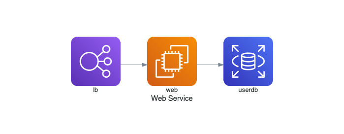
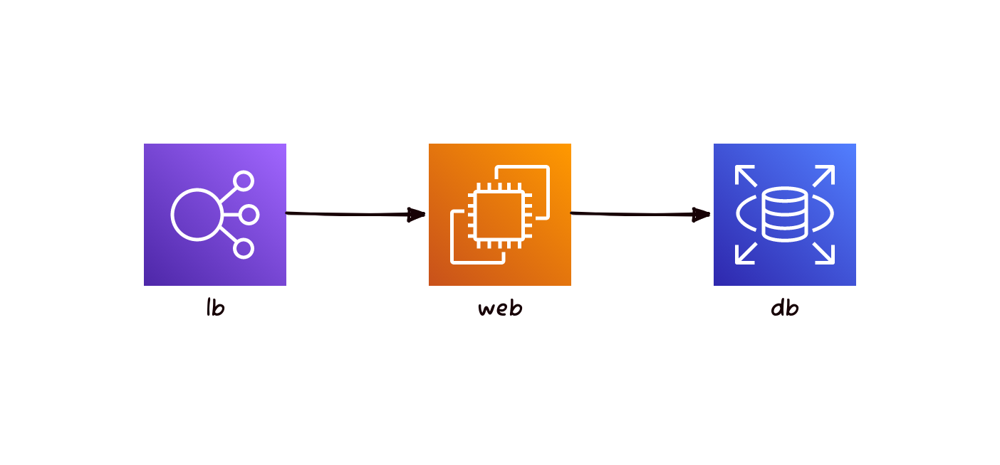
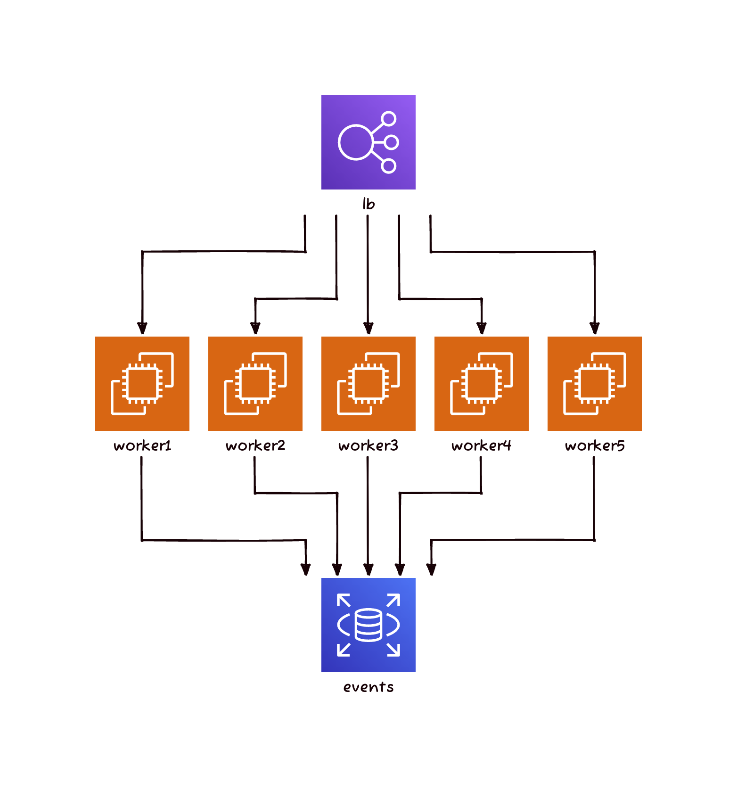

클라우드의 솔루션 아키텍트는 아키텍쳐 다이어그램을 자주 그리게 됩니다.
다이어그램을 그리는 도구는 여러가지가 있는데 [Draw.io](https://www.drawio.com)같은 서비스가 대표적입니다.
이런 도구는 GUI로 다이어그램을 그리게 되는데 의외로 많은 시간이 소모됩니다.
또한 아키텍트마다 아키텍쳐 그리는 패턴도 달라서 같은 아키텍쳐도 서로 다른 그림을 그리게 됩니다.
최근에는 이런 점을 개선하고자 Diagram as Code 개념이 생겼습니다.
사실은 오래전부터 있었던 개념이나 일반적인 다이어그램을 그리는데 중심이 되어있었고 클라우드 아키텍쳐를 그리는데 최적화 된것은 아니었습니다.
그래서 클라우드 아키텍쳐를 그리는데 초점이 맞쳐진 코드도 있습니다.
바로 한국인 개발자가 개발한 [Dirgrams](https://diagrams.mingrammer.com)코드 입니다. 
이 코드는 오픈소스이고 나름 명성을 가지고 있습니다.
하지만 주 개발자가 바쁜지 한동안 업데이트가 안되고 있습니다.
물론 Fork를 해서 이어 개발할수도 있겠지만 공식적으로 아카이빙이 되지 않는 한 포크한 프로젝트도 유지보수가 안 될 가능성이 있습니다.
그래서 대안을 살펴보던 중 D2란 코드를 발견했습니다.
[D2](https://d2lang.com)는 더 많은 사용자를 확보했고 golang기반이입니다.
그러나 클라우드 아키텍처에 쓰이는 데는 아직까지 불편함이 있습니다. 
그래서 D2로 Dirgrams 예제를 똑같이 그려보면서 클라우드 아키텍처 Tool로 적합한지 알아보려고 합니다.


Diagrams의 [Quick Start](https://diagrams.mingrammer.com)에는 아래 예제가 있습니다.

```python
from diagrams import Diagram
from diagrams.aws.compute import EC2
from diagrams.aws.database import RDS
from diagrams.aws.network import ELB
  
with Diagram("", show=False):
    ELB("lb") >> EC2("web") >> RDS("userdb") 
```


매우 단순한 코드이나 여기서도 하나 눈여겨볼 것은 >>로  인스턴스간의 관계를 나타낸것입니다.
이는 연산자 오버로딩이란 기능으로 인스턴스 객체끼리 정의되어 있는 기존 연산자 기능을 바꾸어 정의하는것 입니다.
>>는 rshift란 연산자였던 것입니다.

이 아키텍쳐를 D2에서 그릴려면 아래와 같이 작성하면 됩니다.
```
direction: right
  
lb: "lb" {
  shape: image
  icon: https://icon.icepanel.io/AWS/svg/Networking-Content-Delivery/Elastic-Load-Balancing.svg
  width: 100
  height: 100
}
  
ec2: "web" {
  shape: image
  icon: https://icons.terrastruct.com/aws%2FCompute%2FAmazon-EC2_light-bg.svg
  width: 100
  height: 100
}
  
db: "db" {
  shape: image
  icon: https://icons.terrastruct.com/aws%2FDatabase%2FAmazon-RDS.svg
  width: 100
  height: 100
}
  
lb -> ec2 -> db 
  
```



간단한 그림이므로 거의 유사하게 만들수 있습니다. 
">>" 연산자가 -> 으로 변경되었습니다.
다만 Diagrams에서는 각 항목이 인스턴스객체로 쉽게 불러올 수 있으나 D2에서는 직접 그림파일을 이용하여 shape로 지정해야되는 불편함이 있습니다.
D2에 Class기능과 Import기능이 있습니다.
이것들을 이용하여 아래와 같이 바꿔보겠습니다.

먼저 Class역할을 해줄 파일을 만듭니다.

 
그리고 이렇게 파일을 작성하면 똑같은 결과를 보여줍니다.


두번째 예제는 Diagrams에 있는 Examples중 첫번째 예제입니다.
Grouped Workers on AWS
```python
  from diagrams import Diagram
  from diagrams.aws.compute import EC2
  from diagrams.aws.database import RDS
  from diagrams.aws.network import ELB
  
  with Diagram("Grouped Workers", show=False, direction="TB"):
      ELB("lb") >> [EC2("worker1"),
                    EC2("worker2"),
                    EC2("worker3"),
                    EC2("worker4"),
                    EC2("worker5")] >> RDS("events")
```

각 항목이 인스턴스이므로 이 인스턴스들을 리스트로 만들수 있고 한번에 연결 명령을 줄 수 있습니다.




  ```text
  direction: down
  
  lb: "lb" {
    shape: image
    icon: https://icons.terrastruct.com/aws%2FNetworking%20&%20Content%20Delivery%2FElastic-Load-Balancing.svg
    width: 100
    height: 100
  }
  
  worker1: {
    shape: image
    icon: https://icons.terrastruct.com/aws%2FCompute%2FAmazon-EC2_light-bg.svg
    width: 100
    height: 100
  }
  worker2: {
    shape: image
    icon: https://icons.terrastruct.com/aws%2FCompute%2FAmazon-EC2_light-bg.svg
    width: 100
    height: 100
  }
  worker3: {
    shape: image
    icon: https://icons.terrastruct.com/aws%2FCompute%2FAmazon-EC2_light-bg.svg
    width: 100
    height: 100
  }
  worker4: {
    shape: image
    icon: https://icons.terrastruct.com/aws%2FCompute%2FAmazon-EC2_light-bg.svg
    width: 100
    height: 100
  }
  worker5: {
    shape: image
    icon: https://icons.terrastruct.com/aws%2FCompute%2FAmazon-EC2_light-bg.svg
    width: 100
    height: 100
  }
  
  db: "events" {
    shape: image
    icon: https://icons.terrastruct.com/aws%2FDatabase%2FAmazon-RDS.svg
    width: 100
    height: 100
  }
  
  lb -> worker1 -> db
  lb -> worker2 -> db
  lb -> worker3 -> db
  lb -> worker4 -> db
  lb -> worker5 -> db
  
  ```

  ```bash
  d2 -s -t 302 -l elk example2.d2 exmaple2_elk.png
  d2 -s -t 302 -l dagre example2.d2 exmaple2_darge.png
  ```
-
  ```python
  direction: right
  container1: "" {
    web1
    web2
    web3
  }
  
  container2: "" {
    userdb
    userdb ro
  }
  
  dns -> lb
  lb -> container1.web1
  lb -> container1.web2
  lb -> container1.web3
  
  container1.web1 -> container2.userdb
  container1.web2 -> container2.userdb
  container1.web3 -> container2.userdb
  
  container1.web1 -> memcached
  container1.web2 -> memcached
  container1.web3 -> memcached
  
  container2.userdb -- container2.userdb ro
  ```

  ```python
  dns: "dns" {
    shape: image
    icon: https://icons.terrastruct.com/aws%2FNetworking%20&%20Content%20Delivery%2FAmazon-Route-53.svg
    width: 100
    height: 100
  }
    
  lb: "lb" {
    shape: image
    icon: https://icons.terrastruct.com/aws%2FNetworking%20&%20Content%20Delivery%2FElastic-Load-Balancing.svg
    width: 100
    height: 100
  }
  
  memcached : "memcached" {
    shape: image
    icon: https://icons.terrastruct.com/aws%2FDatabase%2FAmazon-ElastiCache.svg
    width: 100
    height: 100
  }
      
  container1.web1: "web1" {
    shape: image
    icon: https://icons.terrastruct.com/aws%2FCompute%2FAmazon-Elastic-Container-Service.svg
    width: 100
    height: 100
  }
   
  container1.web2: "web2" {
    shape: image
    icon: https://icons.terrastruct.com/aws%2FCompute%2FAmazon-Elastic-Container-Service.svg
    width: 100
    height: 100
  }
    
  container1.web3: "web3" {
    shape: image
    icon: https://icons.terrastruct.com/aws%2FCompute%2FAmazon-Elastic-Container-Service.svg
    width: 100
    height: 100
  }
  container2.userdb: "uesrdb" {
    shape: image
    icon: https://icons.terrastruct.com/aws%2FDatabase%2FAmazon-RDS.svg
    width: 100
    height: 100
  }
  
  container2.userdb ro: "uesrdb ro" {
    shape: image
    icon: https://icons.terrastruct.com/aws%2FDatabase%2FAmazon-RDS.svg
    width: 100
    height: 100
  }
  
  direction: right
  container1: "Services" {
    web1
    web2
    web3
  }
  
  container2: "DB Cluster" {
    userdb
    userdb ro
  }
  
  dns -> lb
  lb -> container1
  container1 -> container2.userdb
  container2.userdb -- container2.userdb ro
  container1 -> memcached
  ```
Diagrams 리포지토리 : [https://github.com/mingrammer/diagrams](https://github.com/mingrammer/diagrams)
D2 리포지토리: [https://github.com/terrastruct/d2](https://github.com/terrastruct/d2)
